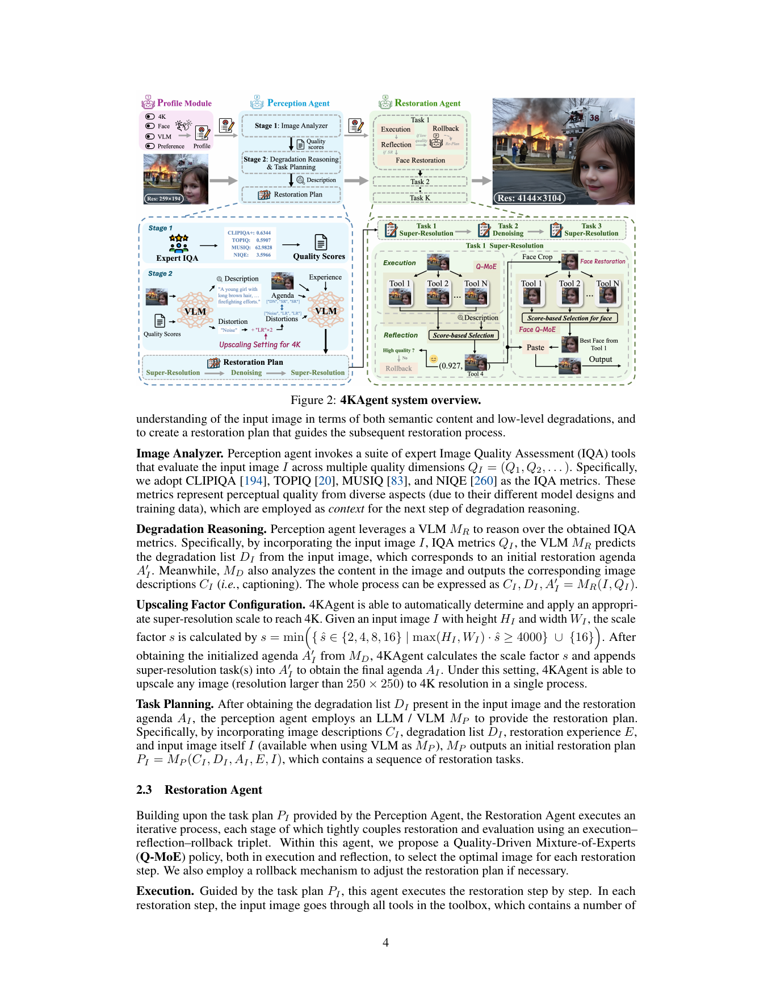

# 4KAgent：Agentic Any Image to 4K Super-Resolution

> 论文：Yushen Zuo 等，NeurIPS 2025。下文按所提供 PDF 的正文与附录阅读整理。
>
> 原文 PDF：`D:\Zotero\DATA\storage\S657UF8N\Zuo 等 - 2025 - 4KAgent Agentic Any Image to 4K Super-Resolution.pdf`

## 1. 一句话理解

4KAgent 不把“超分辨率”看成一个固定网络的一次前向推理，而是把任意图像的恢复过程组织成一个可配置的智能体工作流：先用 IQA 工具和 VLM 观察图像，再制定恢复计划，随后调用多种恢复专家，并用质量评分选择结果；如果某一步变差则回滚。核心目标是把复杂、未知、混合退化的图像统一放大到 4K，论文还加入了面部专用恢复和用户配置 Profile。

## 2. 作者是怎样写出这篇论文的

这篇论文的写作主线很清楚，可以按“现实需求 → 现有范式失效 → 智能体系统 → 分模块解决 → 跨域实验”来读：

1. **先扩大问题边界。** 传统 SR 往往假设训练时已知退化、固定放大倍数、自然图像域；论文把问题改写为“any image to 4K”，强调旧照片、AIGC、卫星、显微镜和医学图像都可能进入同一个系统。
2. **再指出固定网络的结构性局限。** 对真实图像来说，噪声、模糊、压缩、低照度等退化常常未知且叠加；一个只训练过某种合成退化的专家很难覆盖所有情况。
3. **提出系统级答案。** 感知 Agent 负责看懂图像和退化，恢复 Agent 负责执行，Q-MoE 负责在多个工具输出之间做选择，Rollback 负责纠错，Profile 负责让用户改变偏好。
4. **用可解释模块承接创新点。** 论文没有只报一个整体分数，而是分别解释 Perception、Restoration、Face Restoration、Profile、DIV4K-50 数据集。
5. **最后用宽实验支撑“泛化”。** 实验覆盖经典 SR、RealSR、多退化恢复、16× 放大、联合恢复与 4K、AIGC、卫星、荧光显微镜和医学图像；这对应开头提出的“跨域任意图像”叙事。

阅读时要注意：论文的创新重心不是提出一个全新的像素级恢复算子，而是把已有恢复模型组织成一个可感知、可规划、可反馈的系统，并用质量策略决定何时、调用哪个工具。

## 3. 问题背景与传统方法速览

### 3.1 经典单图超分辨率

- **插值法**：最近邻、双线性、双三次（bicubic）只根据邻域像素估计高分辨率值，速度快、不会凭空引入复杂纹理，但细节恢复能力有限。许多 SR 数据集用 bicubic 下采样构造低/高质量图像对。
- **CNN SR**：SRCNN 一类模型直接学习 LR 到 HR 的映射；残差 CNN 通过预测细节残差提高训练稳定性。优点是高效，缺点是常依赖合成退化与固定尺度。
- **Transformer SR**：SwinIR、HAT 等用窗口注意力或层级结构建模远距离依赖，通常更擅长结构和纹理，但参数、显存和推理成本更高。
- **生成式/扩散 SR**：DiffBIR、OSEDiff 等利用预训练生成模型的图像先验，视觉感更逼真，但可能“幻觉式”补细节，PSNR 与感知质量之间存在取舍。

### 3.2 常见评价指标

- **PSNR**：像素误差的对数度量，越高越接近参考图，但不一定代表更自然。
- **SSIM**：比较局部亮度、对比度和结构，通常比 PSNR 更符合结构相似性。
- **LPIPS / FID**：使用深层特征衡量感知距离或分布距离，越低通常越好。
- **NIQE、MUSIQ、MANIQA、CLIPIQA**：不需要 GT 的质量评价；它们反映自然性、感知质量或人类偏好，但不能直接等同于真实度。

## 4. 方法总览



### 4.1 先读图：四条主线

把图从左到右读，可以得到四个阶段：

1. **Profile Module**：先决定系统采用什么 VLM/LLM、是否 4K、放大倍数、是否做人脸恢复、是否提亮，以及更偏向 Perception 还是 Fidelity。
2. **Perception Agent**：图像先经过专家 IQA，得到 CLIPIQA、TOPIQ、MUSIQ、NIQE 等质量分数；接着 VLM 综合图像、质量分数和已有经验，判断内容与退化，并输出恢复计划。
3. **Restoration Agent**：每个任务步骤把当前图像送入工具箱中的候选模型，得到多个候选结果；Q-MoE 依据质量分数挑选一个。如果分数低于阈值，就回滚到上一步并改换任务。
4. **Face Restoration Pipeline**：当计划中包含超分且人脸检测结果稳定时，单独裁剪人脸、调用多个人脸专家，用身份相似度和人脸质量指标选择最佳脸，再贴回原图。

### 4.2 Perception Agent 的四个子步骤

1. **Image Analyzer**：并行调用 IQA 工具，得到多视角质量上下文，而不是把一个质量模型当成绝对真值。
2. **Degradation Reasoning**：VLM 产出内容描述 `C_I`、退化列表 `D_I` 和初始恢复议程 `A'_I`。这里的内容描述很重要，因为后续 HPSv2 要根据“这张图里是什么”评估候选结果是否符合人类偏好。
3. **Upscaling Factor Configuration**：从 `{2, 4, 8, 16}` 中选择足以达到 4000 像素长边的尺度；若图像太小，可以通过递归流程实现更大倍数。
4. **Task Planning**：LLM/VLM 结合描述、退化、议程、恢复经验和图像，生成有顺序的任务计划，例如“超分 → 去噪 → 超分”。顺序本身就是系统决策的一部分。

### 4.3 Restoration Agent：Q-MoE 与 Rollback

论文定义了 9 类工具：提亮、散焦去模糊、运动去模糊、去雾、去噪、去雨、JPEG 压缩伪影去除、超分和人脸恢复。

对计划中的第 `k` 步，候选工具都处理当前图像 `I_(k-1)`，得到 `T_i(I_(k-1))`。随后计算质量分数：

```text
Q_s = HPSv2(图像内容偏好) + no-reference IQA 的加权组合
I_k = argmax_i Q_s(T_i(I_(k-1)))
```

这就是 **Quality-Driven Mixture-of-Experts**：执行阶段让多个专家产生候选，反思阶段用质量策略做路由。它不是训练一个稀疏 MoE 门控网络，而是推理时的“候选生成 + 质量选择”。

若 `Q_s(I_k) <= η`，系统把该步骤视为失败，回到 `I_(k-1)`，生成失败信息并换用其他恢复任务。Rollback 解决的是 Agent 常见的错误累积：错误的前一步不能继续污染后续步骤。

### 4.4 面部恢复为什么单独处理

普通 SR 可能提高整体纹理，却破坏身份、皮肤质感或面部结构。因此论文把人脸视为“感知敏感区域”：对超分后的每张脸分别调用多个专用工具，并用 ArcFace 特征余弦相似度衡量身份保持，再结合通用 IQA 与 CLIB-FIQA 选择结果。这比简单地把整幅图送进一个人脸模型更像一个条件触发的子流程。

## 5. 论文创新点的学习价值

### 创新 1：把恢复从“模型”升级成“闭环工作流”

输入不再一次性决定一个输出，而是经历观察、计划、执行、评价、回滚。这个思路可迁移到去雾、去雨、医学图像处理等任务，但闭环是否有效取决于质量评价是否可靠。

### 创新 2：用 VLM 连接高层语义和低层恢复

VLM 不直接生成最终像素，而是负责识别“图里有什么、可能哪里坏了”；具体像素处理仍由专业恢复模型完成。这种分工降低了让通用大模型直接做低层视觉操作的风险。

### 创新 3：Profile 把偏好显式化

“高保真”与“更好看”不是同一个目标。论文用 profile 选择 Fidelity/Perception，并区分 PSNR/SSIM 型模型和 NIQE/MUSIQ 型模型。这是对感知—失真权衡的工程化表达。

### 创新 4：递归 4K 与跨域工具箱

对于 256×256 输入，16× 到 4096×4096 是极端放大。论文通过多步 SR 和每步质量反馈处理，而不是要求一个模型一次性完成所有尺度与所有领域。

## 6. 实验如何证明主张

- 经典 SR：在 B100 等数据集上，不同 Profile 可分别取得较高保真或较高感知质量；例如论文报告的 B100 结果中，`ExpSR-s4-F` 的 PSNR 为 28.09，`ExpSR-s4-P` 的 MUSIQ 为 69.42。
- RealSR：论文报告在 NIQE、MUSIQ 等无参考感知指标上取得很强结果，并且超过 AgenticIR。
- 多退化：在 MiO100 Group C 上，GenMIR-P 配置的 4KAgent 报告 PSNR 19.77、SSIM 0.5629、MUSIQ 55.56。
- 跨域：卫星、显微镜和医学图像实验用于支撑“工具箱 + Profile 的域泛化”，但不能理解成一个模型学到了所有医学成像物理；它主要依赖通用恢复专家与质量选择。

## 7. 可能的局限与批判性阅读

1. **质量指标可能与真实任务目标不一致。** NIQE、MUSIQ、HPSv2 的高分不保证医学诊断信息或身份信息不被改变。
2. **候选工具的成本可能很高。** 每一步调用多个工具再评分，系统吞吐量会受工具数量和 VLM/LLM 延迟影响。
3. **“任意图像”仍受工具箱覆盖限制。** 新的退化类型、不同成像物理或特殊域如果没有合适工具，感知 Agent 也只能在已有工具中选择。
4. **生成式细节存在真实性风险。** 4K 输出更清晰不等于恢复了真实细节，尤其是旧照片和医学图像应区分“视觉改善”和“事实保真”。

## 8. 建议的复现/学习路径

先画出 `I_0 → Perception → Plan → {Tool candidates} → Q-MoE → Rollback? → I_k`；然后分别替换三个部件思考：如果去掉 VLM、如果只保留一个工具、如果不做 rollback，会在哪些退化上失败？最后再读附录中的 prompt、工具列表、profile 和 DIV4K-50 构造方式。

## 9. 术语小结

| 术语 | 在本文中的含义 |
|---|---|
| RealSR | 真实拍摄、退化未知或复杂的超分辨率场景 |
| VLM | 能同时处理图像与文本的视觉语言模型 |
| IQA | Image Quality Assessment，图像质量评价 |
| Q-MoE | 用多个恢复工具产生候选，再按质量分数选优 |
| Rollback | 当前恢复结果不合格时回退到上一步 |
| Profile | 不训练模型而配置恢复目标和偏好的接口 |
