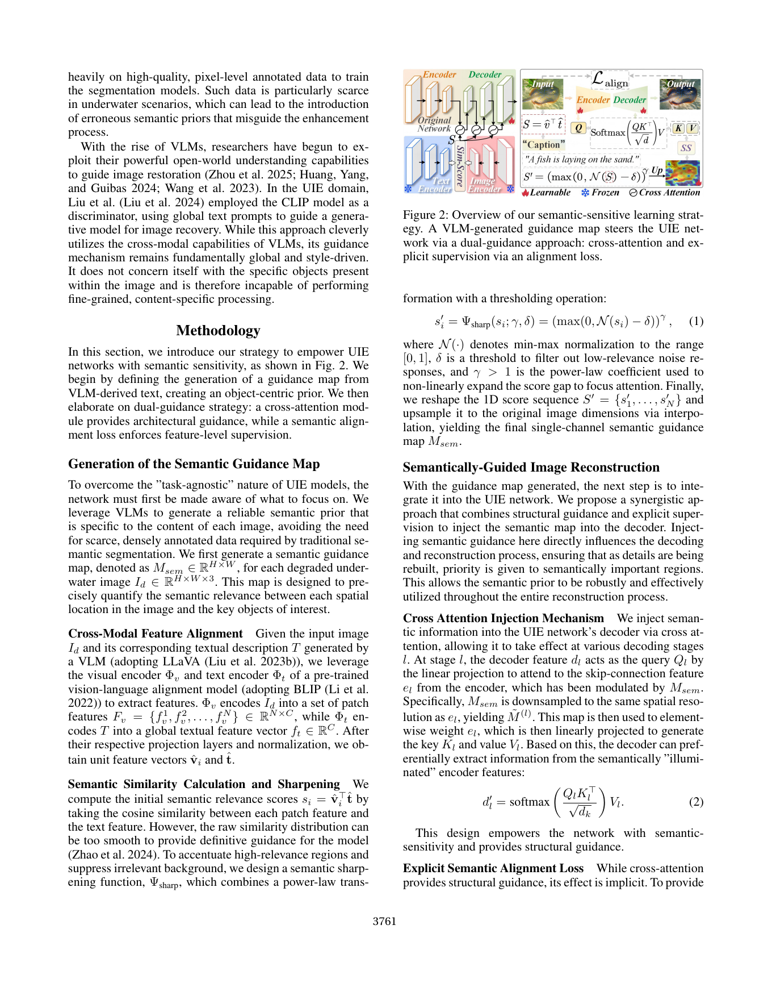

# Empowering Semantic-Sensitive Underwater Image Enhancement with VLM

> 论文：Guodong Fan 等，AAAI-26。下文按所提供 PDF 的正文整理。
>
> 原文 PDF：`D:\Zotero\DATA\storage\K6Z8FUX8\Fan 等 - 2026 - Empowering Semantic-Sensitive Underwater Image Enhancement with VLM.pdf`

## 1. 一句话理解

这篇论文解决的不是“水下图像看起来够不够亮”这么简单的问题，而是：增强后的图像是否仍然保留鱼、潜水员、海底垃圾等目标的语义线索，能否帮助检测和分割。作者让 VLM 先描述图像中的关键对象，再用 BLIP 式图文对齐把文本重新定位到图像空间，形成语义引导图，最后通过解码器交叉注意力和显式语义对齐损失引导 UIE 网络重点恢复关键区域。

## 2. 写作思路：从“增强悖论”到可插拔策略

作者的论证链条可以概括为：

1. **提出增强悖论。** 人眼觉得更清晰、更鲜艳的结果，不一定更利于检测器或分割器；全局均匀增强可能破坏机器需要的局部语义。
2. **指出标注瓶颈。** 用语义分割图指导增强需要高质量像素级标签，而水下场景标注稀缺且容易出错。
3. **区分“全局文本提示”和“对象级语义”。** “a clear underwater photo” 这类提示只能改变整体风格，不能告诉模型“鱼在哪里、海草在哪里”。
4. **用 VLM 产生开放世界语义，再用图文模型定位。** VLM 负责开放词汇描述，BLIP 负责把描述与视觉 patch 对齐。
5. **用双重引导落到网络内部。** 交叉注意力改变信息流，alignment loss 直接约束中间特征；前者是结构性引导，后者是监督性引导。
6. **通过可插拔实验验证泛化。** 把 `-SS` 机制加到 PUIE、SMDR、UIR、PFormer、FDCE 五个基线中，观察 UIE、检测和分割三类指标是否都提升。

## 3. 背景与经典方法解释

### 3.1 水下退化的物理直觉

水会吸收不同波长的光，也会因散射造成雾化、低对比度和颜色偏移。传统水下增强常使用成像物理模型估计背景光、透射率和颜色衰减，再反演清晰图像；当真实环境不满足假设时，容易产生颜色失真或放大噪声。

### 3.2 常见 UIE 方法

- **直方图均衡/子直方图均衡**：拉开灰度分布，提高对比度；可能过度增强噪声或导致颜色不自然。
- **CNN 编码器—解码器**：编码器提取多尺度特征，解码器重建图像；适合学习复杂映射，但如果训练目标只有像素重建，可能忽略检测语义。
- **Retinex/物理先验**：把亮度与反射/颜色分开建模，提供可解释性，但分解在水下复杂场景中并不稳定。
- **语义分割引导**：用目标区域 mask 告诉网络哪里重要；优点是明确，缺点是需要昂贵的像素级标注。
- **CLIP/VLM 指导**：把图像和文本放到共同特征空间；全局文本提示可控制风格，但单一文本通常不能提供精确空间定位。

## 4. 结构图精读



建议先忽略公式，只跟踪三种颜色/符号：冻结的 VLM/BLIP、可训练的 UIE 网络、语义图进入解码器的箭头。

### 4.1 从输入到语义引导图

1. 输入退化水下图像 `I_d`。
2. LLaVA 根据图像生成文本描述 `T`，例如“a fish is laying on the sand”。它不是要求精确分割，而是提供关键对象的自然语言概念。
3. BLIP 的视觉编码器把图像变成 `N` 个 patch 特征 `f_v^i`，文本编码器把描述变成全局文本向量 `f_t`。
4. 分别归一化得到 `v_hat_i` 与 `t_hat`，计算每个 patch 和文本之间的余弦相似度：

```text
s_i = v_hat_i^T t_hat
```

5. 原始相似度可能比较平滑、背景也有弱响应，因此用阈值和幂函数锐化：

```text
s'_i = (max(0, Normalize(s_i) - δ))^γ
```

`δ` 用来去除低相关噪声，`γ > 1` 拉大高相关区域与其他区域的差距。最后把 patch 分数 reshape 并上采样到原图，得到单通道 `M_sem`。

这里要理解一个关键点：`M_sem` 不是人工分割标签，而是“这个位置与文本描述对象有多相关”的软先验。因此它可以在没有密集标注的情况下生成，但也会继承 VLM 与图文对齐模型的错误。

### 4.2 语义图如何改变 UIE 解码器

在解码器第 `l` 层，解码特征 `d_l` 作为 Query，编码器跳连特征 `e_l` 先乘以同尺度的语义图 `M_tilde^(l)`，再生成 Key 和 Value：

```text
d'_l = softmax(Q_l K_l^T / sqrt(d_k)) V_l
```

直觉上，网络不是把所有 skip feature 等权取回，而是让语义显著区域的特征更容易被 decoder 取用。论文消融还显示：只在 decoder 注入比只在 encoder 或所有阶段注入更好，因为真正决定“如何形成输出图像”的阶段是重建阶段。

### 4.3 显式语义对齐损失

交叉注意力是隐式改变信息流，论文再对 decoder 中间特征 `F^(l)` 加：

```text
L_align = ||F^(l) ⊙ (1 - M_tilde^(l))||_F^2 - η <F^(l), M_tilde^(l)>
```

它包含两个方向：

- 背景抑制：让非关键区域不要产生过强无关响应。
- 前景增强：鼓励关键区域的特征响应与语义图一致。

最终损失为 `L_total = L_recon + λ_align Σ_l L_align^(l)`。其中 `L_recon` 由 L1 像素损失与 VGG-19 特征空间的感知损失组成，兼顾像素忠实度和结构纹理。

## 5. 论文创新点与学习启发

### 创新 1：把“语义”变成空间图，而不止是文本条件

许多 prompt-based restoration 方法把文本作为全局条件；本文进一步问“文本描述对应图像上的哪里”，形成可作用于 decoder 的二维先验。这是从全局风格控制走向对象中心增强。

### 创新 2：VLM + 图文对齐模型分工

LLaVA 负责开放词汇、自然语言层面的“说出对象”；BLIP 负责 patch—text 相似度。这种分工减少了要求一个模型同时承担描述和精确定位的压力。

### 创新 3：双重引导互补

仅靠注意力可能只是改变路径，未必让中间特征真正“语义化”；仅靠 loss 又不能保证结构信息在正确位置流动。交叉注意力 + alignment loss 分别覆盖网络路径和优化目标。

### 创新 4：可插拔而非重造基线

作者把策略加到五个不同的 encoder-decoder UIE 模型上，强调方法作为插件的适应性。学习这类论文时，要观察作者是否证明了“方法本身有效”，而不只是“某个新网络有效”。

## 6. 实验解读

- UIEB 上，PUIE-SS 的 PSNR/SSIM/LPIPS 为 23.20/0.884/0.092，相比 PUIE 的 21.05/0.869/0.117 有明显提升；其他基线也总体受益。
- 下游检测中，PFormer-SS 的 mAP 从 95.50 提到 96.87；分割中其 mIoU 从 69.34 提到 74.75。说明提升不只体现在“看起来更漂亮”。
- 消融显示 BLIP 生成的 guidance map 比 ViT class attention 和 CLIP 的热图更集中、边界更干净；但这只是论文当前实验设置下的比较，不应外推成 BLIP 在所有任务上都最好。
- Decoder-only 注入在论文中优于 Encoder-only 和 All-stages，支持作者“语义先验应在重建阶段直接影响图像形成”的解释。

## 7. 批判性阅读与潜在风险

1. **VLM 描述错误会传导。** 如果 LLaVA 漏掉目标、把海草认成鱼，后面的图文相似度会把错误变成空间引导。
2. **软相似度不等于准确分割。** `M_sem` 是相关性热图，不能自动保证目标边界精确。
3. **语义优先可能牺牲背景质量。** alignment loss 主动压低非关键区域响应，若下游任务需要背景上下文，可能出现反效果。
4. **成本与训练/推理边界要区分。** 论文强调该机制可插拔，但 LLaVA 和 BLIP 是否在推理阶段运行、如何缓存/部署，应结合实现代码进一步确认；不要把训练时的教师模型成本直接忽略。

## 8. 读完后应掌握的抽象模板

```text
目标对象/任务 → 产生语义描述 → 图文对齐定位 → 形成软空间先验
→ 在重建网络中注入先验 → 用额外损失约束中间特征 → 用下游任务验证
```

这比单纯加入一个注意力模块更完整，因为它同时回答了“先验从哪里来、作用在哪里、如何被训练、如何验证”。
