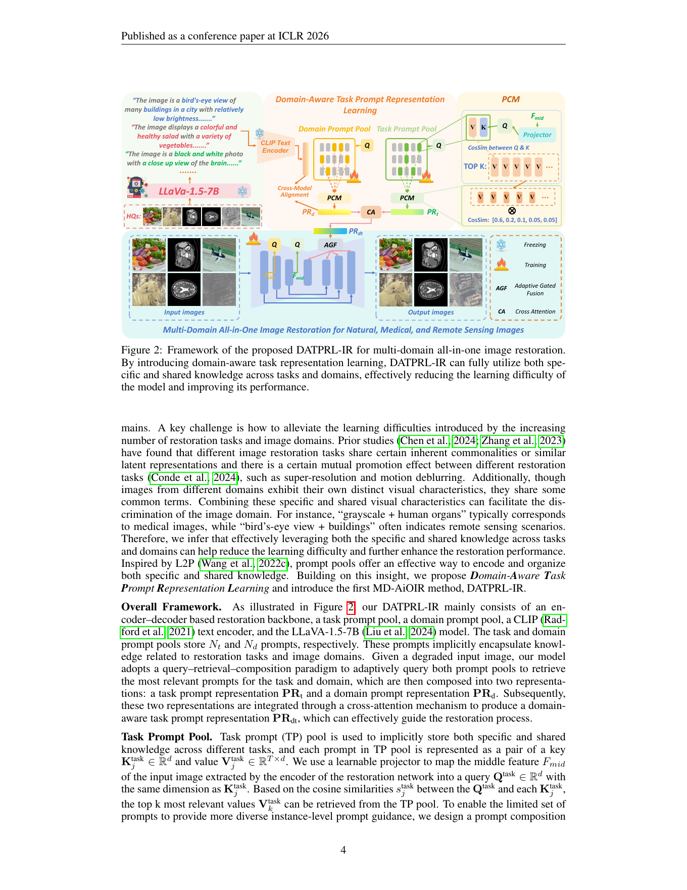

# DATPRL-IR：Learning Domain-Aware Task Prompt Representations for Multi-Domain All-in-One Image Restoration

> 论文：Guanglu Dong 等，ICLR 2026。论文将其方法称为 Domain-Aware Task Prompt Representation Learning（DATPRL），并据此构建 DATPRL-IR。
>
> 原文 PDF：`D:\Zotero\DATA\storage\8HW2Z9CV\Dong 等 - 2026 - LEARNING DOMAIN-AWARE TASK PROMPT REPRE- SENTATIONS FOR MULTI-DOMAIN ALL-IN-ONE IM- AGE RESTORATION.pdf`

## 1. 一句话理解

DATPRL-IR 试图让一个图像恢复模型同时处理自然图像、医学图像和遥感图像中的多个任务。它维护两个可学习的 prompt pool：task prompt pool 存“做什么恢复任务”的知识，domain prompt pool 存“图像来自什么领域”的知识；模型根据输入图像查询并组合 prompt，再通过 cross-attention 和 adaptive gated fusion 将二者注入 encoder-decoder 恢复骨干。

## 2. 写作思路：为什么要同时建模任务与领域

论文的写作路线是“单域 AiOIR 的成功 → 多域扩展的困难 → 共享/特定知识的分解 → 双 prompt pool → 实验验证可扩展性”：

1. 先回顾 AiOIR：一个模型处理去雨、去模糊、超分等多种任务，避免为每个退化训练单独网络。
2. 指出既有工作大多只在一个图像域内区分任务，遇到自然、医学、遥感混合时，模型还需要学会领域差异。
3. 提出“任务之间、领域之间都有共享知识，也都有特定知识”。例如超分和去模糊都需要结构恢复；“灰度 + 人体器官”更像医学，“俯视 + 建筑”更像遥感。
4. 借鉴 L2P 的 prompt pool，把知识分散存放在一组 key-value prompt 中，并对每个实例动态检索，而不是给每个任务硬编码一个固定 prompt。
5. 使用 MLLM 生成高质量图像的领域描述，再通过 CLIP 文本特征对 domain prompt 做跨模态约束；MLLM 与 CLIP 只用于训练，推理时不增加开销。
6. 用 6-task/3-domain、9-task/3-domain、prompt 数量、MLLM 替换、prompt 设计和泛化实验说明方法并非只适用于一个任务。

## 3. 传统方法与术语解释

### 3.1 单任务恢复

经典做法是为每种任务训练一个模型：SR 恢复空间分辨率，去雨估计雨纹，去模糊估计模糊核或直接学习逆映射，医学 CT 去噪则需要考虑成像噪声分布。优点是目标明确，缺点是部署多个模型、维护多个权重，并且模型之间不能共享知识。

### 3.2 All-in-One Image Restoration

AiOIR 用一个网络处理多种退化。常见路线包括：

- **对比学习**：让不同退化的特征可区分，同时共享清晰图像表征。
- **prompt learning**：让可学习 prompt 编码退化或任务条件。
- **显式指令**：用文字说明“去雨/去噪/超分”，但依赖指令表达能力。
- **MoE**：设置多个专家或复杂度专家，按输入分配计算。
- **退化分类**：先判断退化类别，再条件化恢复。

本文与它们的区别是：不仅查询 task prompt，还查询 domain prompt，并让二者在实例级组合。

### 3.3 PSNR、SSIM 与 Fourier loss

PSNR 偏像素保真，SSIM 偏结构相似；论文还把 L1 误差放到 Fourier 域，约束频域中的低频亮度与高频纹理变化。频域损失不是“自动更好”，它的价值在于给多任务恢复提供一种跨域共享的结构/纹理约束。

## 4. 结构图精读



图中颜色是重要线索：橙色对应 domain prompt，绿色对应 task prompt，蓝色区域是实际恢复 backbone；火焰表示训练，雪花表示冻结。

### 4.1 左侧：MLLM 不是推理期恢复器

高质量图像输入 LLaVA-1.5-7B，生成“内容、颜色、亮度、拍摄视角”等多角度文本描述。这些描述进入 CLIP Text Encoder，产生领域语义特征，进而通过 cross-modal alignment 约束 domain prompt。

这一步的教育性重点是：MLLM 负责把视觉领域知识蒸馏进 prompt，而不是在每次推理时阅读图片并生成恢复结果。论文明确说明 LLaVA 与 CLIP 在 inference 阶段不使用。

### 4.2 两个 prompt pool 如何查询

每个 prompt 是 key-value 对：key 用于匹配输入，value 携带真正注入网络的表示。

**Task Prompt Pool：**

1. encoder 的中间特征 `F_mid` 经过 projector 得到 query `Q_task`。
2. 与所有 task keys 做余弦相似度。
3. 选 top-k task values。
4. 用相似度 softmax 权重组合成实例级 task representation `PR_t`。

论文的组合公式可读成：

```text
α_j = softmax(sim(Q_task, K_j) / T_task)
PR_t = Σ_j α_j V_j
```

因此，prompt pool 不是“一个任务对应一个向量”的查表，而是多个 prompt 的软混合。这样既能保留任务特定信息，也能让相近任务共享部分 prompt。

**Domain Prompt Pool：**

1. 第一层浅层特征经过另一个 projector 得到 `Q_dom`。
2. 查询 domain keys，选择 top-k domain values。
3. 通过同样的 PCM 组合成 `PR_d`。
4. 用 LLaVA/CLIP 文本特征对 `PR_d` 加跨模态对齐损失，使它不只是任意可学习向量，而更可能编码领域先验。

浅层特征适合看颜色、灰度、视角等域属性；中间特征更适合判断具体恢复任务，这是一个结构上合理的分工。

### 4.3 中间：Domain-Aware Task Representation

`PR_t` 和 `PR_d` 通过 cross-attention 融合成 `PR_dt`。它不是简单拼接，因为 cross-attention 允许一类表示选择性读取另一类表示，形成“这个领域中的这个任务”的条件。

随后在骨干的不同层使用 Adaptive Gated Fusion：

```text
F_el = CrossAttn(α_l F_l, (1 - α_l) PR_dt)
```

`α_l` 是每层可学习门控系数。不要把它理解成全网络一个固定比例：不同层可能更依赖原始恢复特征，也可能更需要 prompt 条件。论文分析发现多数层仍主要依赖 backbone，prompt 更多是辅助指导；较早的块往往更依赖 prompt。

### 4.4 Prompt 正则化解决什么问题

双 prompt pool 可能出现三个退化：所有 prompt 学成相似内容、模型只依赖少数 prompt、不同输入选择趋同。论文因此加入：

- **Diversity regularization**：惩罚 prompt value 两两相似度过高，防止表示塌缩。
- **Balance/entropy regularization**：鼓励 prompt 被更均衡地使用。
- **Contrastive regularization**：增强实例级 prompt 选择的敏感性，细节在附录。

## 5. 论文创新点

### 创新 1：首次把 AiOIR 推向多域统一设置

论文声称这是首个 multi-domain all-in-one image restoration 探索。真正需要学习的不只是“去什么退化”，还有医学、自然、遥感的成像风格、颜色和结构差异。

### 创新 2：任务知识与领域知识解耦但可融合

只用 task prompt 容易忽略域差异，只用 domain prompt 又不足以决定恢复操作。双池把“做什么”和“在哪里做”拆开，再通过 cross-attention 组合。

### 创新 3：从固定条件改成实例级检索与组合

同一个 domain 内的图像并不完全相同，同一个 task 也可能跨域。top-k + softmax PCM 允许 prompt 表示随实例改变。

### 创新 4：用 MLLM 蒸馏领域先验且不增加推理成本

MLLM 只在训练期间提供文本语义约束，部署时依赖轻量 projector、prompt pool 和恢复 backbone。这是“训练期用大模型，推理期去掉大模型”的典型思路。

## 6. 实验解读

- 在 6-task/3-domain 设置中，DATPRL-IR-6T 平均 PSNR/SSIM 为 30.77/0.8653，高于表中的 MoCEIR 30.40/0.8627。
- 从 6-task 扩展到 9-task，原有任务没有明显退化，论文据此支持“任务之间存在可迁移共享知识”。这比只展示一个任务上的最好分数更能支撑方法动机。
- TP 与 DP 单独使用都能提高性能，二者同时使用最好。例如表 2 中 Rain100L 去雨的 PSNR 从无 prompt 的 38.34 提高到双池的 39.56。
- prompt 数量和 top-k 存在折中：太少表达能力不足，太多会引入冗余；论文设置 task/domain prompt 数均为 15，top-k 分别为 3/5。
- 更换 LLaVA-1.5-13B 或 Qwen3-VL-2B-Instruct 后结果变化很小，说明该方法主要需要粗粒度域描述，并非强依赖某个特定 MLLM。

## 7. 批判性阅读

1. **“领域”与“任务”并不总能严格分离。** 医学 MRI SR 和自然图像 SR 的恢复难点可能已经交织，双池是建模假设，不是物理定律。
2. **prompt pool 的语义可解释性有限。** 虽然 domain prompt 受 CLIP 对齐约束，但每个 prompt 未必能被人直接命名为“医学 prompt”。
3. **实验依赖多套数据集与合成退化。** 跨域性能提高可能部分来自数据配比、任务互补或训练设置，需进一步看 zero-shot 与真实混合退化实验。
4. **PSNR/SSIM 不能覆盖医学安全性。** 医学图像的视觉清晰不等价于诊断可靠，部署时还需任务特定验证。

## 8. 学习问题

- 如果把 domain prompt pool 改成一个显式域标签，会损失什么？答案是失去盲恢复和域内实例差异，也不能自然处理未知域。
- 如果把 task/domain representation 直接相加，为什么可能不如 cross-attention？因为加法没有显式建模两种知识之间的条件读取关系。
- 为什么 prompt pool 需要 diversity 与 balance？因为可学习的 key-value 检索很容易只使用少量 prompt，最终退化为一个小字典或单 prompt 模型。
