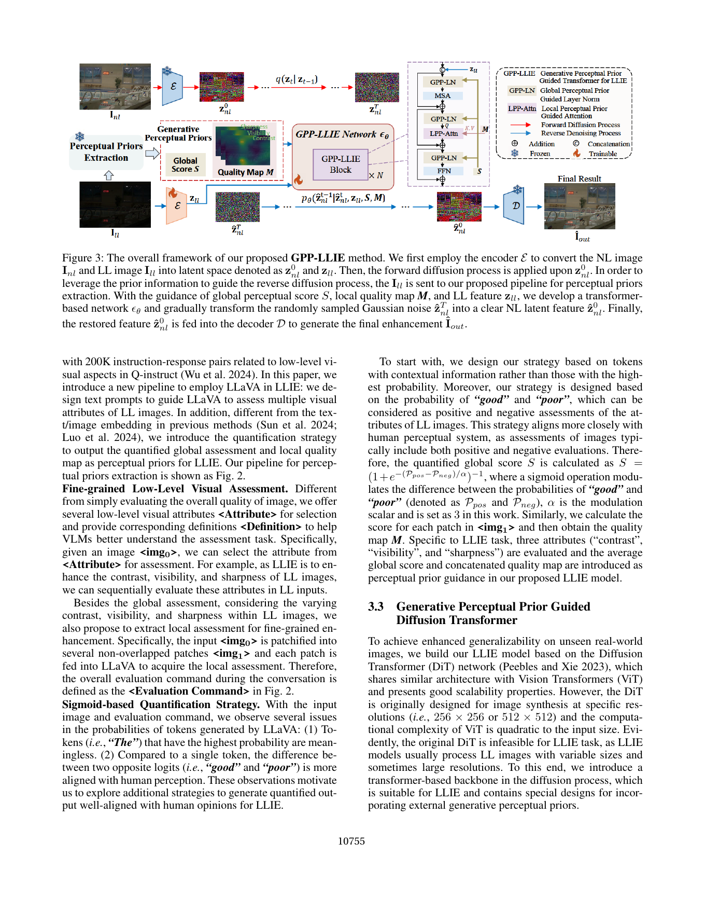

# GPP-LLIE：Low-Light Image Enhancement via Generative Perceptual Priors

> 论文：Han Zhou 等，AAAI 2025。GPP-LLIE = Generative Perceptual Prior guided LLIE。
>
> 原文 PDF：`D:\Zotero\DATA\storage\4WSKLL27\Zhou 等 - 2025 - Low-Light Image Enhancement via Generative Perceptual Priors.pdf`

## 1. 一句话理解

GPP-LLIE 让经过低层视觉指令微调的 LLaVA 评价低光图像的对比度、可见性和锐度，把自然语言模型的判断量化为全局分数 `S` 与局部质量图 `M`，再把它们注入一个扩散式 Transformer：`S` 调制 LayerNorm，`M` 引导局部注意力。目标是让模型面对未见过的真实照明条件时，更有依据地决定哪里该提亮、哪里要避免过曝。

## 2. 写作思路

这篇论文沿着“真实场景泛化难 → 传统先验不足 → VLM 能感知低层属性 → 量化 VLM 输出 → 设计能接收先验的扩散网络”来展开：

1. 先展示 real-world LLIE 的核心痛点：模型在成对数据集上表现好，但在真实图像上容易过曝、颜色失真或局部不均衡。
2. 说明边缘、语义、照明图等传统先验可以提升稳定性，却很难从严重退化输入中可靠预测真实细节。
3. 注意到 VLM 在低层视觉属性上已具备一定感知能力，作者不让它描述复杂场景，而是用提示让它评估 contrast、visibility、sharpness。
4. 进一步把 VLM 的 token 概率变成连续数值，用 good/poor 两个相反评价的概率差做 sigmoid，得到全局和局部先验。
5. 仅有先验还不够，因此把 DiT 改造为适合可变分辨率图像恢复的 GPP-LLIE 网络，并设计 GPP-LN 与 LPP-Attn 两个注入点。
6. 用 LOL、LOL-v2、真实无 GT 数据集和消融实验验证：先验提取有用、局部先验和全局先验承担不同功能。

## 3. 传统方法与经典组件

### 3.1 低光增强传统方法

- **Gamma correction**：用非线性曲线整体调整亮度，简单快速，但很难处理一张图中不同区域的曝光差异，也可能放大噪声。
- **Histogram equalization / CLAHE**：重新分配灰度，增强对比度；局部方法更细致，但会改变颜色或增强噪声。
- **Retinex**：把图像视为照明与反射的组合，分别估计 illumination 和 reflectance；可解释，但低光和噪声下分解不稳定。
- **监督 CNN**：用低光—正常光配对训练，像素损失容易得到稳定结果，但泛化到不同照明分布有限。
- **Zero-reference LLIE**：不需要成对 GT，使用曝光、颜色、平滑等约束；训练方便，但手工损失可能不能覆盖真实感知。

### 3.2 扩散模型

前向过程逐步向正常光 latent 加噪，反向过程学习从噪声恢复清晰 latent。它的优势是生成逼真纹理，缺点是推理慢、可能改变原始内容，并且需要谨慎设计条件信息。本文使用扩散框架，但任务仍是条件恢复，不是无条件图像生成。

### 3.3 Transformer 与 DiT

ViT/DiT 用 token self-attention 建模远距离关系。原始 DiT 主要为固定分辨率生成而设计，LLIE 需要处理不同大小和高分辨率图像；论文因此去除固定 positional embedding，采用更适合恢复的 Transformer block 和局部/通道注意力。

## 4. 图 2：VLM 如何变成感知先验

论文 Fig. 2 通过对话提示的形式展示先验提取流程；它虽不是独立结构图文件，但论文 Fig. 3 左侧已包含主要数据流，本文使用 Fig. 3 作为主图。

## 5. 图 3 结构图精读



从图中可以分成上方正常光监督路径、下方低光条件路径和中间反向扩散路径。

### 5.1 编码与扩散路径

1. 正常光图像 `I_nl` 与低光图像 `I_ll` 经过冻结 encoder `E`，分别得到 `z^0_nl` 和 `z_ll`。
2. `z^0_nl` 在训练时走 forward diffusion，逐步变成带噪的 `z^T_nl`。
3. 反向过程从随机高斯噪声 `z_hat^T_nl` 开始，逐步预测清晰的正常光 latent `z_hat^0_nl`。
4. 低光 latent `z_ll` 在反向网络中作为条件；最后由冻结 decoder `D` 把恢复 latent 解码为增强结果。

这条路线的一个重要概念是：训练时可以用正常光配对图像定义扩散目标，但推理时只有低光图像，模型要依靠 `z_ll`、全局分数和局部质量图完成恢复。

### 5.2 左侧：感知先验提取

低光图像进入 VLM pipeline，分别评估 contrast、visibility、sharpness：

- **Global Score `S`**：描述整张图整体感知质量。
- **Quality Map `M`**：把图像切成不重叠 patch，逐块询问 VLM，再把每块评分拼回空间图。

作者不直接取最高概率 token，因为类似 “The” 的 token 可能概率最高但没有评价意义；而是比较正面词 “good” 和负面词 “poor” 的概率：

```text
S = sigmoid((P_pos - P_neg) / α)
```

论文设置 `α = 3`。对每个 patch 做同样的计算得到 `M`，再对三个属性的结果进行平均/拼接。这样把离散语言判断转为可送入神经网络的连续条件。

### 5.3 右上：GPP-LN

全局分数 `S` 先通过 MLP 产生缩放和偏移参数 `γ, β`，调制 LayerNorm：

```text
z_out = γ(S) · LN(z_in) + β(S)
```

LayerNorm 原本只根据当前特征做归一化；GPP-LN 让“图像整体有多差、需要多大程度调整”影响特征分布。它不是把 `S` 直接加到 latent 上，而是通过 scale/shift 改变网络的工作状态，因此更稳定。

### 5.4 右中：LPP-Attn

局部质量图 `M` 进入 LPP-Attn，决定不同空间位置/特征通道的注意力。论文为降低高分辨率 self-attention 的二次复杂度，沿 channel 维计算注意力；query 来自输入特征，key/value 受局部先验引导。直觉是：不同 patch 的曝光、清晰度不同，网络不能用同一个增强力度处理整张图。

### 5.5 Concat-and-Remove

每个 GPP-LLIE block 开始时把低光 latent 条件拼接进输入，block 末尾移除后半通道，使下一 block 仍能再次注入低光信息。它解决了两个问题：保持低光原始内容条件，同时控制通道数量和显存。

## 6. 论文创新点

### 创新 1：把 VLM 的低层感知变成连续先验

很多视觉语言方法只使用 caption 或 embedding；本文把“好/差” token 的概率差量化为 `S` 和 `M`，得到更贴近人类评估的标量与空间条件。

### 创新 2：全局与局部先验分工

全局分数决定整个网络的调制状态，局部质量图决定空间注意力。一个回答“整体需要多大程度增强”，另一个回答“哪里更需要增强”。

### 创新 3：用扩散 Transformer 做 LLIE 条件恢复

作者没有直接照搬原始 DiT，而是根据 LLIE 的可变分辨率、高分辨率和条件恢复需求，设计去位置嵌入、低光条件注入和 channel attention。

## 7. 实验解读

在 LOL、LOL-v2-real、LOL-v2-synthetic 上，论文报告 GPP-LLIE 的 FID/LPIPS/DISTS/PSNR 分别优于表中对比方法，例如 LOL-v2-real 的 FID 为 26.78、LPIPS 为 0.055、DISTS 为 0.047、PSNR 为 29.23。

消融最有教育意义：

- 去掉局部先验和 LPP-Attn 的 Variant 1 性能变差，说明全局先验不足以处理空间不均匀照明。
- 用 Spatial Feature Transform 替代 LPP-Attn 也不如原方法，说明不是“随便加个条件层”就能得到同样效果。
- 去掉全局先验或直接把分数加到 latent 的 Variant 3/4 更差，支持 GPP-LN 的 scale/shift 注入方式。

## 8. 局限与批判性阅读

1. **VLM 评分可能不稳定。** `good/poor` 概率会受 prompt、tokenization 和模型校准影响，连续分数不等于物理亮度测量。
2. **VLM 感知先验可能放大偏差。** 真实低光图像中的颜色偏差、噪声和物体语义可能使 VLM 关注错误属性。
3. **配对训练与真实泛化需区分。** 论文在有 GT 数据集上训练、在无 GT 数据集上测试，说明有一定泛化，但不等于完全摆脱配对数据依赖。
4. **扩散推理仍有成本。** 论文用 25 步采样加速，但与轻量 CNN/查表方法相比仍可能不适合极端边缘设备。
5. **增强结果可能生成不存在的纹理。** FID 和 LPIPS 好转代表感知分布更接近，不自动保证每个细节都是原场景真实信息。

## 9. 学习问题

- 为什么需要 `S` 和 `M` 两种先验？因为只知道全图“差”不能定位局部过暗区域，只看 patch 又缺少整体曝光语境。
- 为什么不直接把 `S` 加到 latent？直接相加改变数值分布过于生硬；GPP-LN 把先验转为归一化后的尺度/偏移，更像条件调制。
- 这篇论文与水下语义敏感增强的共同点是什么？都是把 VLM 输出转换为可作用于恢复网络的先验；区别是前者主要建模低层感知质量，后者主要建模对象语义与空间位置。
