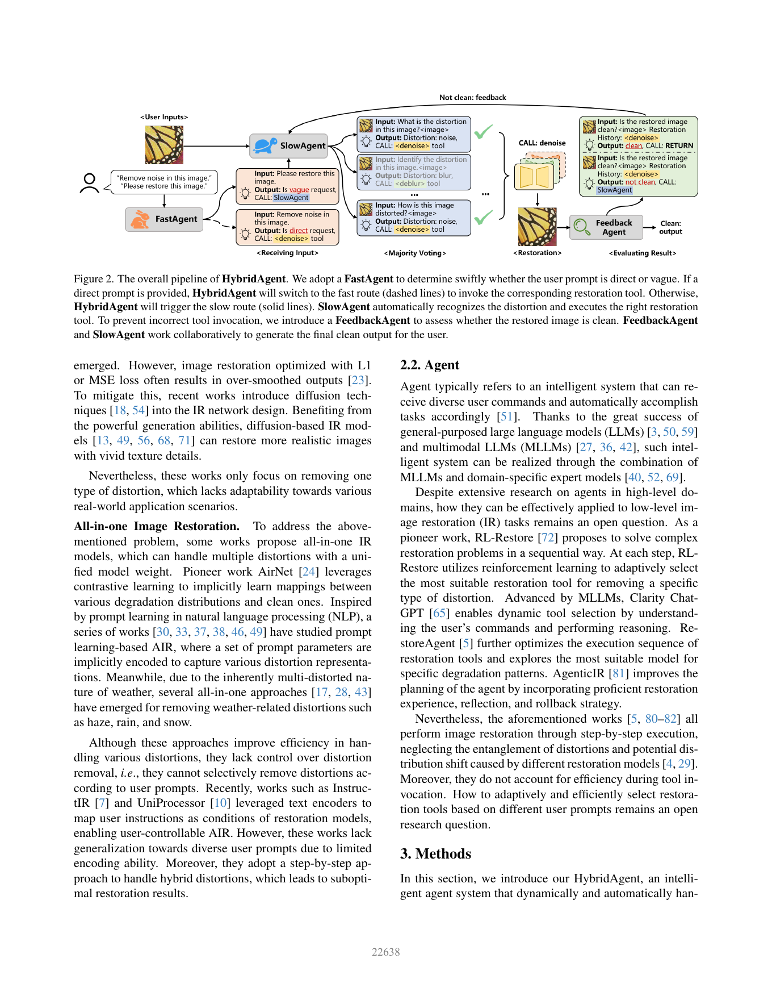
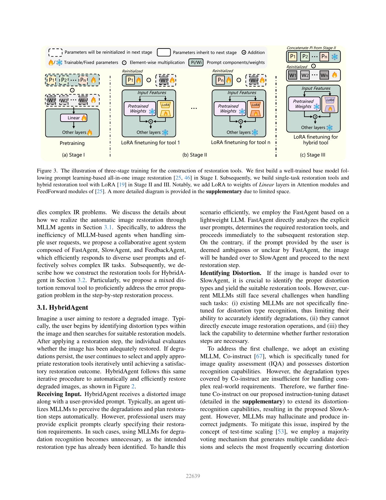

# HybridAgent：Hybrid Agents for Image Restoration

> 论文：Bingchen Li、Xin Li、Yiting Lu、Zhibo Chen，CVPR 2026。下文按所提供 PDF 的正文整理。
>
> 原文 PDF：`D:\Zotero\DATA\storage\LJZG9PGB\Li 等 - 2026 - Hybrid Agents for Image Restoration.pdf`

## 1. 一句话理解

HybridAgent 用 FastAgent、SlowAgent、FeedbackAgent 协作处理图像恢复：简单明确的用户指令走轻量 LLM 快速路径，含糊复杂的指令交给经过指令微调的 MLLM 慢速路径；恢复之后由 FeedbackAgent 判断是否已经“干净”。同时，作者训练单退化工具和混合退化工具，避免把噪声、模糊、JPEG 等强行按顺序逐个去除而产生误差传播。

## 2. 作者的写作思路

论文围绕两个问题组织全文：

1. **交互效率问题。** 现有 agent 往往所有请求都调用重型 MLLM；“请去掉噪声”这种明确请求其实不需要复杂推理。
2. **混合退化问题。** 真实图像通常同时有模糊、噪声、压缩、低照等退化。逐步调用单退化模型时，前一个模型会改变后一个模型面对的数据分布，造成错误传播。
3. **提出双层解决方案。** Fast/Slow/Feedback agents 解决“谁来判断、何时结束、怎么交互”；三阶段训练与 mixed distortion removal tool 解决“工具本身如何适应混合退化”。
4. **把效率和质量同时量化。** 论文不仅比较 PSNR/SSIM/LPIPS，也比较平均推理时间、显存和工具调用成功率。
5. **用案例图解释组合策略。** 在“雨滴 + 模糊 + 噪声 + JPEG”中，HybridAgent 可能先用 De-hybrid，再用 De-raindrop，而不是机械地调用四个单退化工具。

## 3. 传统方法与关键术语

### 3.1 单任务图像恢复

CNN 擅长局部滤波，Transformer 能建模长距离依赖，扩散模型擅长生成自然纹理。去噪、去模糊、去雨、去雾、压缩伪影去除和超分通常各自有专用网络。专用模型目标明确，但真实部署要维护一整套模型。

### 3.2 All-in-One Restoration

AirNet、PromptIR 等尝试用一个网络处理多种退化，常见方法是对比学习、prompt、显式 instruction 或 MoE。它们通常比多个独立模型更省资源，但可能缺少用户控制，也未必能处理混合退化的顺序关系。

### 3.3 LoRA

LoRA 冻结大部分预训练权重，只在权重旁增加低秩更新。本文把共享基础模型作为底座，再用不同 LoRA 表示不同单退化工具或混合退化工具。推理时切换 LoRA，相比加载完整独立模型更节省存储和切换成本。

## 4. 图 2：智能体工作流精读



沿着图从左到右读：用户输入 → 快速/慢速路由 → 退化识别与工具调用 → FeedbackAgent 评价 → 继续或输出。

### 4.1 FastAgent：先判断请求是否清楚

FastAgent 使用轻量 Llama3.2-1B-Instruct，通过 in-context learning 判断用户 prompt 是 direct 还是 vague：

- “Remove noise in this image.” 属于 direct，直接调用 denoise tool。
- “Please restore this image.” 属于 vague，不能确定退化类型，转交 SlowAgent。

这一步不是判断图像质量，而是判断“用户已经告诉系统足够多了吗”。因此它能省掉明确任务上的 MLLM 调用。论文表 1 报告，开启 fast route 后的平均时间大约是关闭时的 12% 左右，而性能整体接近。

### 4.2 SlowAgent：复杂请求的视觉推理

SlowAgent 是基于 Co-Instruct 进一步微调的 MLLM，输入图像和用户指令，输出退化类型与工具调用。为了降低 MLLM 幻觉，论文使用多数投票：生成多个候选判断，选择出现次数最多的退化。

它解决的不是像素恢复，而是：图像中有何种退化、应该调用哪个工具、是否还需要后续处理。真正的图像操作交给 restoration tools。

### 4.3 FeedbackAgent：让系统知道何时停止

恢复后，FeedbackAgent 判断结果是否 clean。它不仅看当前图像，也把历史调用的工具作为上下文：

- 若 clean，返回最终结果。
- 若 not clean，把当前状态反馈给 SlowAgent，继续选择工具。

这个角色很重要，因为只让 SlowAgent 自己判断“做完了吗”容易受自身决策偏差影响；外部反馈把恢复变成闭环。

## 5. 图 3：三阶段训练如何构造工具



### Stage I：预训练共享基础模型

使用多任务训练得到一个 all-in-one foundation restoration model。它学习不同退化之间的共享知识；prompt components 隐式编码退化信息，网络主体建立通用恢复能力。

### Stage II：用 LoRA 得到单退化工具

基础模型被冻结，针对每一种退化训练一个 LoRA 和对应 prompt。论文处理的 10 类退化包括 noise、Gaussian blur、motion blur、JPEG、HEVC、VVC、rainstreak、raindrop、haze、low light。

Stage II 的关键不是从零训练 10 个模型，而是让每个工具继承 Stage I 的共享表示，只学习任务差异。

### Stage III：训练混合退化工具

混合工具初始化使用 Stage II 的 prompt，再用合成的混合退化数据训练新的 LoRA。图中右侧表示：共享预训练权重固定，混合工具自己的 LoRA 可训练，同时继承 Stage II prompt 的信息。

它的作用是直接处理联合退化，减少多次单退化调用造成的分布偏移；但作者也承认混合工具的表达能力受训练混合组合覆盖范围限制，所以仍需与单退化工具协同。

## 6. 为什么逐步单退化恢复会失败

假设输入是 `motion blur + noise + JPEG`：

```text
I_0 --去 JPEG--> I_1 --去噪--> I_2 --去运动模糊--> I_3
```

每个工具训练时看到的退化分布可能与上一步输出不同，且前一步可能已经改变边缘、纹理和噪声统计。后续模型的输入因此不再是它熟悉的分布，出现分布偏移和错误传播。

混合工具相当于先学习：

```text
I_0 --De-hybrid--> 一个更接近 clean 的中间结果
```

再用某个单工具处理残留退化。论文表 3 中，在 Blur+Noise、Motionblur+Noise+JPEG、Haze+Noise、Low light+JPEG 等组合上，Both（单工具 + 混合工具）普遍优于 Only Single。

## 7. 论文创新点

### 创新 1：按请求复杂度选择 Agent

Fast/Slow 不是简单的大小不同模型，而是不同推理策略：明确请求不做不必要的视觉推理，模糊请求才调用重型 MLLM。

### 创新 2：把反馈作为独立 Agent

FeedbackAgent 让“停止恢复”成为显式决策，并能读取历史工具。这是从单向 pipeline 走向交互闭环的关键。

### 创新 3：混合工具 + 单工具协同

论文不把 mixed tool 当成所有情况都适用的万能模型，而是让它先处理纠缠退化，再让单工具精修，形成工具级的组合策略。

### 创新 4：共享基础模型 + LoRA 工具化

三阶段训练使多种工具共享主体知识，LoRA 负责任务偏移；这让工具切换更像加载不同适配器，而非切换大量完整网络。

## 8. 实验解读

- Fast route 对 direct prompt 平均耗时显著下降，表 2 中 FastAgent 在去模糊、去雨、去雾等任务上的工具调用成功率很高，但在 noise、VVC、low light 上不一定超过 SlowAgent，说明轻量路由器并非普遍更准确。
- 混合退化结果：表 3 的平均值中，Only Single 为 PSNR 19.84、SSIM 0.557、LPIPS 0.444，Both 提高到 24.83、0.741、0.284。
- 与 AgenticIR 比较时，HybridAgent 的平均推理时间为 11.66 s，对方为 49.34 s；论文把效率优势归因于轻量 FastAgent 和 LoRA 工具切换。
- 复杂真实样例中，论文展示先 De-hybrid 再 De-haze 的流程，说明 FeedbackAgent 能让混合工具与单工具协作，而不是固定地连续调用全部工具。

## 9. 批判性阅读与潜在局限

1. **训练混合组合有限。** 10 类退化的组合空间很大，未出现过的组合仍可能让 mixed tool 失效。
2. **代理错误与工具错误相互耦合。** 正确识别退化不保证对应工具恢复得好，FeedbackAgent 的“clean”判定也可能与人类偏好不一致。
3. **模型尺寸表需谨慎解释。** 论文中的 HybridAgent Size 为 400.82M，虽然使用 LoRA 适配，但整个系统仍不是轻量模型；效率主要来自调用方式和共享权重。
4. **反馈标签的构造很关键。** FeedbackAgent 使用正确工具结果构造 clean、错误工具结果构造 not clean；这是一种可行的监督方式，但与真实用户“是否满意”不完全等价。
5. **PSNR/SSIM/LPIPS 仍不能充分反映用户控制。** 明确指定只去噪时，保持其他退化可能比追求全局最优更重要。

## 10. 学习问题

- FastAgent 的路由标签与 SlowAgent 的退化识别标签有什么不同？前者判断“指令是否明确”，后者判断“图像有什么退化”。
- 为什么混合工具不是简单地把单工具串起来？因为串联会导致输入分布逐步偏移，而混合工具在训练时直接看到联合退化。
- 为什么还需要 FeedbackAgent？因为即使工具选择正确，也可能只去掉部分退化；系统需要判断是否继续以及是否尊重中间结果。

## 11. 按全文顺序通读

### 摘要与引言：两个挑战对应两组方法

引言先列举传统 IR 的任务空间：去噪、去模糊、压缩伪影去除和超分。单任务模型质量高但工具多；all-in-one 模型更方便但不够可控。接着用一个 `Motionblur + noise + JPEG` 例子说明：先去 JPEG、再去噪、最后去运动模糊，后一步看到的已经不是原始混合退化分布，因此可能得到比一个直接的 hybrid tool 更差的结果。

随后提出两个挑战：

1. 用户 prompt 有时清楚、有时模糊，单一 MLLM 路径要么浪费资源，要么理解能力不足；
2. 单退化工具串行调用时存在退化纠缠、分布偏移和错误传播。

FastAgent/SlowAgent/FeedbackAgent 对应第一个挑战，三阶段训练和混合工具对应第二个挑战。全文结构几乎是逐一回答这两个问题。

### 相关工作：作者为什么不直接采用已有 agent

单任务 CNN 有较强的局部处理能力，Transformer 提供长距离依赖，扩散模型生成逼真纹理，但它们大都只移除一种退化。AirNet、PromptIR、InstructIR 等 AiOIR 模型能够处理多种退化，却往往采用一个统一权重或逐步调用，难以根据自然语言选择性处理。

RL-Restore、Clarity ChatGPT、RestoreAgent、AgenticIR 已经把工具调用、规划、反思和回滚带入恢复。本文认为它们仍有三个缺口：所有请求都调用重型代理、依赖单退化工具的串行执行、没有充分处理退化纠缠。因此 HybridAgent 的定位是“更有效的 agent 组织方式 + 更合适的工具训练方式”。

## 12. Agent 部分的完整数据流

### 12.1 Receiving Input：用户 prompt 先成为控制信号

输入是图像和文本 prompt，不是只有图像。若用户说“remove noise”，系统不必再让 VLM 从图像推断需求；若用户只说“restore this image”，系统需要看图。

这实际上把“任务识别”拆成两种信息源：显式的人类要求和隐式的图像退化。FastAgent 先判断显式 prompt 是否足够，SlowAgent 再补足隐式判断。

### 12.2 FastAgent：轻量路由器而非恢复模型

FastAgent 基于 Llama3.2-1B-Instruct，用 in-context examples 判断 prompt direct/vague 并选工具。它的成功率在不同退化上并不一致：去模糊、运动模糊、雨条和去雾上较高，去噪、VVC、低光上较弱。这个细节很重要：FastAgent 的目标是降低平均成本，不是替代 SlowAgent 的全部判断能力。

### 12.3 SlowAgent：识别、调用与多数投票

SlowAgent 以 Co-Instruct 为起点，再用作者的指令数据集微调。指令数据包含不同退化和用户表达方式，使 MLLM 学会回答“是什么退化”和“调用什么工具”。由于 MLLM 可能出现幻觉，论文生成多个候选判断并进行 majority voting。

这是一种 test-time scaling 思路：不改变模型权重，而是增加多个判断样本，用统计共识降低单次错误。代价是推理时间增加。

### 12.4 FeedbackAgent：恢复质量的外部评估器

FeedbackAgent 也基于 Co-Instruct 微调，但任务不是识别退化，而是二分类 clean/not clean。论文构造 30K clean 图像和 33K not-clean 图像：正确工具恢复的结果作为 clean，错误工具恢复的结果作为 not clean。历史工具调用也加入上下文，帮助判断“当前结果虽然不完美，但相对目标是否已足够”。

因此整个 agent 回路为：

```text
用户指令 → FastAgent
  ├─ direct → 直接工具 → FeedbackAgent → clean 输出 / 继续
  └─ vague → SlowAgent 多数投票识别 → 工具 → FeedbackAgent → 循环
```

## 13. Restoration tools 的完整训练逻辑

### 13.1 Stage I：多任务共享底座

Stage I 使用 prompt learning-based all-in-one restoration 思路，在 10 类退化上训练基础模型。作者把前两阶段的一些 Transformer block 换成 shifted-window attention，提高复杂退化下的表征能力。此阶段的目标不是让模型成为所有任务的最优专家，而是学习共享的图像结构和恢复基础。

### 13.2 Stage II：LoRA 单任务适配器

基础模型冻结，针对 noise、Gaussian blur、motion blur、JPEG、HEVC、VVC、rainstreak、raindrop、haze、low light 分别训练 LoRA。LoRA 加在 attention 和 feed-forward 中的 Linear 层，prompt 参数重新初始化并与 LoRA 一起训练。

这里 prompt 和 LoRA 分工不同：prompt 描述退化条件，LoRA 让深层网络适应该退化的分布。若只加 prompt 而不适配深层参数，工具的特定处理能力可能不足；若每个任务都完全重训，参数和训练成本又太大。

### 13.3 Stage III：混合退化 LoRA

混合工具使用 Stage II 的 prompt 初始化，从 Real-ESRGAN 风格的退化合成流程生成联合退化样本，再训练新的 LoRA。这样它继承共享底座和部分任务 prompt，同时学习联合退化的处理方式。

但 mixed tool 不是万能工具：它覆盖的是训练时的混合组合，遇到更复杂或未见组合可能不够精细。因此系统保留单退化工具，用 FeedbackAgent 判断是否需要进一步精修。

## 14. 实验章节的逐表理解

### 14.1 Fast route 的效率—准确度权衡

表 1 比较开启和关闭 fast route。开启后，去噪约 0.08 s、去模糊约 0.11 s、低光约 0.12 s；关闭后对应耗时约 0.75、0.82、0.88 s。PSNR/SSIM 变化很小，说明简单 prompt 上不必每次调用 SlowAgent。

### 14.2 Only Single 与 Both

表 3 比较只用单退化工具和同时使用单/混合工具。平均 PSNR 从 19.84 提高到 24.83，SSIM 从 0.557 提高到 0.741，LPIPS 从 0.444 降到 0.284。Haze + Noise、Low light + JPEG 等组合提升尤其大，验证了退化耦合是串行工具的主要弱点。

### 14.3 与其他方法的比较

表 4 在 Rainstreak+Noise、Haze+Noise、Low light+Noise、Motionblur+Noise 上比较 Uformer、Restormer、AirNet、PromptIR、InstructIR、AgenticIR 和 HybridAgent。HybridAgent 的平均 PSNR/SSIM/LPIPS 为 23.77/0.674/0.330，A.I.T. 11.66 s；AgenticIR 为 23.69/0.668/0.358，49.34 s。

需要同时看到一个容易被忽略的点：HybridAgent 的模型 size 表为 400.82M，因而“效率优势”主要是工具共享、LoRA 切换和快速路由的系统效率，不代表参数规模小。

### 14.4 真实图像案例

EUVP 真实水下图像案例中，HybridAgent 先调用 mixed distortion tool，再调用 dehaze。案例说明作者并没有把系统局限在合成 benchmark，而是用 feedback 让系统根据中间结果决定是否追加工具；但真实数据无 GT 时，视觉效果仍不能完全证明所有退化被正确去除。

## 15. 全文结论与局限

HybridAgent 的完整抽象是：

```text
按用户表达选择推理成本
 + 按图像退化选择工具
 + 用反馈决定是否停止
 + 用混合工具减少串行分布偏移
```

局限包括：混合退化组合空间巨大，训练覆盖有限；FeedbackAgent 的 clean 标签来自工具正确/错误而非真实用户偏好；MLLM 判断与 IQA 分数仍可能不一致；多次候选/多数投票会带来额外延迟。最重要的学习点是不要把“Agent”只理解成一个大模型：在本文中，Agent 是路由、工具、状态、反馈和终止条件组成的系统。
