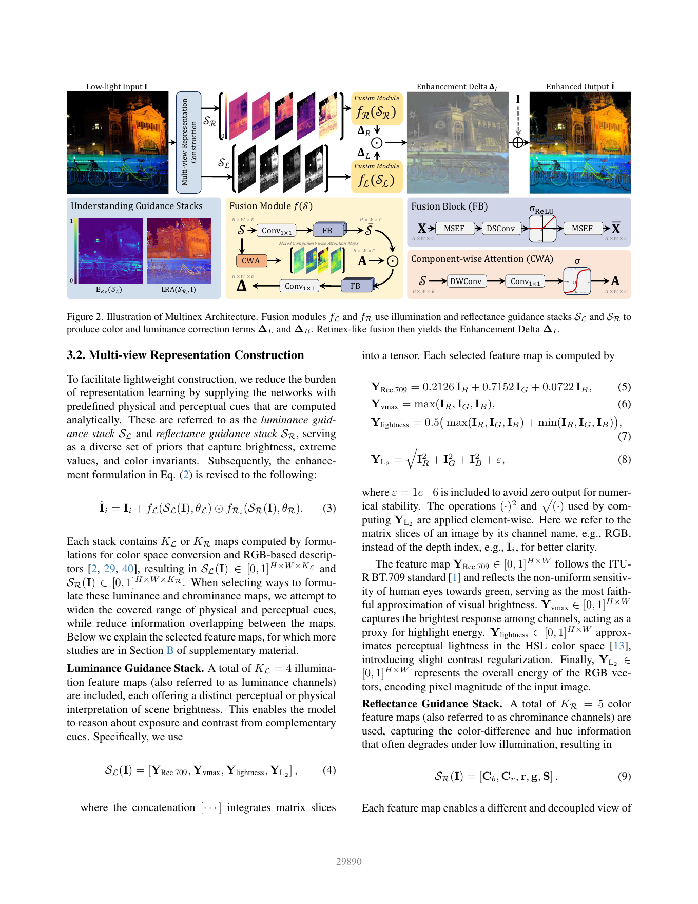

# Multinex：Lightweight Low-light Image Enhancement via Multi-prior Retinex

> 论文：Alexandru Brateanu、Tingting Mu、Codruta O. Ancuti、Cosmin Ancuti，CVPR 2026。论文提供 Multinex（约 44.7K 参数）与 Multinex-Nano（约 0.7K 参数）两个版本。
>
> 原文 PDF：`D:\Zotero\DATA\storage\TQZ63J7W\2026 - Multinex Lightweight Low-light Image Enhancement via Multi-prior Retinex.pdf`

## 1. 一句话理解

Multinex 不让一个极小网络从 RGB 原图中“自己猜”所有亮度和颜色关系，而是先用解析公式构造多视角亮度/颜色先验，再让两个轻量分支分别预测亮度修正和反射/颜色修正，最后以 Retinex 启发的残差形式加回输入图像。核心公式是：保留原图结构，只学习必要的增强增量。

## 2. 写作思路

作者的文章主线是“轻量化困难 → RGB 中亮度与颜色耦合 → 需要可解释的多视角先验 → 用残差而非完整重建 → 用轻量融合模块实现极端压缩”：

1. 先指出当前 LLIE 模型常有数百万甚至数千万参数，难以部署到边缘设备。
2. 再指出极端压缩后性能掉得很快，原因之一是单一颜色空间无法稳定解耦亮度和色度。
3. 传统 Retinex 提供物理直觉，但直接预测 `L` 与 `R` 再相乘做完整重建，容易在低光和噪声下产生不稳定分解。
4. 因此作者把 Retinex 当结构先验，把任务改写为预测 enhancement delta；网络只需学“相对输入应该怎么改”。
5. 进一步使用 4 个 luminance descriptors 和 5 个 reflectance descriptors，把亮度、最大通道、感知明度、RGB 能量、色差、色度比例、饱和度等互补信息显式提供给网络。
6. 最后用 Fusion Block、MSEF、Component-wise Attention（CWA）构造小型融合器，验证在 45K 甚至 0.7K 参数下仍能保持竞争力。

## 3. 传统方法与经典组件

### 3.1 Gamma 与直方图方法

Gamma correction 用非线性曲线整体提亮；直方图均衡通过重新分布灰度拉高对比度。这些方法速度快、无需训练，但无法充分建模局部照明、噪声和颜色偏移。

### 3.2 Retinex 理论

经典 Retinex 假设观测图像可近似写成：

```text
I = L ⊙ R
```

其中 `L` 表示照明，`R` 表示反射/固有颜色与结构。低光增强通常提高 `L`、保留 `R`。RetinexNet、KinD、RetinexFormer 等深度模型学习 illumination/reflectance 或相关表示。优点是亮度与细节有物理解释，缺点是低光噪声下分解本身可能不可靠。

### 3.3 颜色空间

- **YCbCr/YUV**：把亮度与色差分开，减少 RGB 通道耦合。
- **HSV/HSL**：显式包含明度/亮度、色相和饱和度，但色相在低饱和或边界处可能不连续。
- **HVI 等可学习空间**：让网络学习更合适的色彩表示，但训练和跨数据分布稳定性可能受影响。

Multinex 的选择不是押注一个新颜色空间，而是并行取多个解析描述，让轻量网络从互补视角中学习。

## 4. 结构图精读



### 4.1 顶部主路径：输入到增强输出

1. 低光 RGB 输入 `I` 进入 Multi-view Representation Construction。
2. 构造两组堆栈：亮度引导 `S_L` 和反射/颜色引导 `S_R`。
3. `S_L` 进入 luminance fusion module `f_L`，输出单通道或共享三通道的亮度修正 `Δ_L`。
4. `S_R` 进入 reflectance fusion module `f_R`，输出颜色修正 `Δ_R`。
5. 二者按 Retinex-like 结构组合为 `Δ_I = Δ_L ⊙ Δ_R`，再与输入相加：

```text
I_hat_i = I_i + f_L(S_L, θ_L) ⊙ f_R_i(S_R, θ_R)
```

这里的“乘法”发生在修正项之间，整个输出仍保留原始 `I_i`。这与直接预测一张全新图像不同：网络默认输入中的结构大部分是可靠的，只学习照明和颜色需要调整的部分。

### 4.2 亮度引导堆栈 `S_L`

论文使用四张解析亮度图：

```text
S_L = [Y_Rec.709, Y_vmax, Y_lightness, Y_L2]
```

- `Y_Rec.709`：按人眼对绿色更敏感的权重计算感知亮度。
- `Y_vmax`：三个 RGB 通道的最大值，反映最强高光响应。
- `Y_lightness`：最大值和最小值的平均，近似 HSL lightness。
- `Y_L2`：RGB 向量能量，提供像素整体强度。

它们不是重复的四种灰度图：每张图对曝光、亮部、感知亮度和能量的关注不同，给网络提供互补证据。

### 4.3 反射/颜色引导堆栈 `S_R`

```text
S_R = [C_b, C_r, r, g, S]
```

- `C_b, C_r`：蓝差和红差色度，描述相对亮度的颜色变化。
- `r, g`：分别用总 RGB 强度归一化的红、绿色度比例，对绝对照明更不敏感。
- `S`：饱和度，表示颜色相对灰轴的鲜艳程度。

这组先验帮助网络在提亮时减少色偏；它不是为了恢复所有颜色物理，而是为极小网络提供容易利用的结构化输入。

### 4.4 Fusion Module 的内部

每个 fusion module 先用 `1×1 Conv` 把 `K` 张先验映射到 `C` 个特征，再通过一串 Fusion Blocks。图中下方两个模块要这样看：

- **Fusion Block（FB）**：`MSEF → DSConv → ReLU → MSEF`。MSEF 用全局上下文做通道校准，DSConv 用深度可分离卷积做轻量空间过滤，第二个 MSEF 再次校准。
- **CWA**：先用 DWConv 保持各描述分量相对独立，再用 `1×1 Conv` 对齐通道，经过 sigmoid 得到逐分量注意力图 `A`。
- **主融合**：先产生 `S_bar`，再用 CWA 对它做逐位置/逐分量加权，经过额外 FB 与 `1×1 Conv` 变成 `Δ`。

CWA 和 MSEF 的分工可以粗略理解为：CWA 决定“哪些先验分量更值得信”，MSEF 决定“如何在局部空间和通道维细化这些分量”。

## 5. 为什么 enhancement delta 比直接 Retinex 重建更合适

直接预测 `L` 和 `R` 并计算 `L ⊙ R`，要求模型同时完成分解和重建；当输入很暗时，亮度与颜色信息混合，分解误差会被乘法放大。

Multinex 采用：

```text
I_hat = I + Δ_I
Δ_I = Δ_L ⊙ Δ_R
```

这样有三层好处：

1. 原图 `I` 直接提供边缘和结构，轻量网络不必重新生成全部纹理。
2. `Δ_L` 负责曝光修正，`Δ_R` 负责颜色修正，学习问题被分工。
3. 残差通常更容易在极小模型中拟合，且对正常区域更不容易做无意义修改。

## 6. 论文创新点

### 创新 1：多先验而不是单一颜色空间

作者不是学习一个大网络把 RGB 转成某个“理想空间”，而是解析地计算互补的亮度和颜色描述，减少表示学习负担。

### 创新 2：Retinex-guided residual

把 Retinex 从“要重建的输出”改成“组织残差的结构原则”，这是本文最值得记住的概念转化。

### 创新 3：极端轻量化仍保持结构化处理

Multinex 约 44.7K 参数，Multinex-Nano 约 0.7K 参数。Nano 通过减少 FB 深度、空间分辨率和模块复杂度得到，不是把所有先验都删掉。

### 创新 4：CWA 的组件级选择

普通 attention 常把特征通道混合，CWA 为不同解析 descriptor 产生独立的注意力图，更适合“每个先验有不同物理含义”的场景。

## 7. 实验解读

- 在 LOLv1、LOLv2-real、LOLv2-syn 的轻量模型组中，Multinex 的参数约 0.0446M，PSNR 分别为 23.19、23.04、25.04；在极小模型组中，Multinex-Nano 约 0.00069M 参数，仍有 19.42、19.66、21.05 的 PSNR。
- 无参考数据上，Multinex 的平均 NIQE 为 3.64、BRISQUE 为 14.33；Multinex-Nano 的平均 NIQE 为 3.82、BRISQUE 为 16.41。
- ExDark 低光检测中，Multinex-Nano 的 mAP50 为 80.7，论文据此强调增强结果也有利于下游检测，而不是只优化像素指标。
- 消融非常直观：无先验 PSNR 14.15；只用 `Δ_L` 为 20.57；只用 `Δ_R` 为 18.50；两者结合为 23.19。CWA 与 MSEF 同时保留也优于单独保留其中一个。

## 8. 局限与批判性阅读

1. **解析先验不是万能物理模型。** 颜色空间描述是有用的统计/感知线索，不等于真实照明与反射分解。
2. **极暗图像可能放大传感器噪声。** 亮度先验越依赖输入，输入中的噪声也可能被当作细节。
3. **加性残差不适合所有曝光情况。** 高光裁剪、HDR 和复杂人工—自然混合光照可能需要乘性或概率生成模型。
4. **极小模型的跨域稳健性需继续验证。** 论文在多个基准上表现好，但新的传感器、镜头光晕和非自然光源仍可能超出先验覆盖范围。

## 9. 学习问题

- 为什么同时使用 `Y_Rec.709`、`Y_vmax` 和 `Y_lightness`？因为它们分别表达感知亮度、最大通道响应和明暗范围，互补而非简单重复。
- 为什么只用 `Δ_L` 已经比只用 `Δ_R` 好？低光增强的第一瓶颈通常是曝光/亮度，颜色先验更像稳定色彩的辅助。
- 为什么 CWA 比普通 MHSA 更适合这里？每个输入 descriptor 有独立物理含义，过早跨分量混合会削弱组件选择性。

## 10. 按全文顺序通读

### 摘要与引言：轻量化不是简单删层

论文首先把 LLIE 的目标拆成自然可见性、颜色保真和结构细节，同时强调低光输入常伴随曝光不足、对比度低、色偏和噪声。现有 SOTA 依赖大模型与多阶段训练，在边缘设备上不现实；而把模型压到 1M 以下又容易明显掉点。

作者认为性能掉点不只是容量不足，还来自表示方式：RGB 把 luminance 和 chrominance 耦合在一起，模型必须同时猜亮度与颜色。于是本文的轻量化策略不是单纯减少卷积，而是先用解析颜色理论提供信息，再让少量参数专注于融合和修正。

### 相关工作逐段定位

**Deep Learning for LLIE**：早期 CNN 直接从 paired low/normal images 学增强；Transformer 用全局依赖提高感知质量；扩散模型生成细节但推理慢。作者以此说明 Multinex 不追求 SOTA 最大模型的生成能力，而追求极低成本下的稳定性。

**Retinex and Color Frameworks**：Retinex 分解具有物理解释，但很多深度模型仍在 RGB 中处理，亮度与颜色没有真正分离。YCbCr、YUV、HSV、HVI 各有优点与伪影，Multinex 选择多个解析描述的组合。

**Lightweight LLIE**：PairLIE、ZeroDCE、LYT-Net、SCI 等代表不同轻量化路线。论文将 Multinex 放在 lightweight 与 micro 两个区间比较，不仅看大模型是否最优，还看参数、GFLOPs 与下游检测。

## 11. 数学建模逐步解释

### 11.1 从基本 Retinex 到 enhancement delta

基本 Retinex 目标是得到增强后的 `I_hat = L ⊙ R`。作者认为，在低光 RGB 中直接恢复两个完整项会让分解误差和颜色耦合变得难学。因此改为只预测调整量：

```text
I_hat = I + Δ_I
Δ_I = Δ_L ⊙ Δ_R
```

进一步把 `Δ_L` 设为共享于三个 RGB 通道的亮度修正，把 `Δ_R` 设为三通道颜色修正。对第 i 个通道：

```text
I_hat_i = I_i + f_L(I, θ_L) ⊙ f_Ri(I, θ_R)
```

这里不应把 `Δ_L` 误解为传统 Retinex 中的完整 illumination map，它是“需要增加/减少多少亮度”的调整场；同理 `Δ_R` 是颜色调整而不是完整 reflectance。

### 11.2 为什么保留原图

低光图像并非所有像素都错误。边缘、物体轮廓和一部分颜色关系仍然有价值。残差形式把这些信息直接短接到输出，使网络的学习目标从“重新生成整张正常光图”变为“修正输入中有问题的部分”。这也是极小模型仍能工作的主要直觉。

## 12. 多视角表示的完整物理含义

### 12.1 `S_L` 四个亮度描述

`Y_Rec.709` 按 ITU-R BT.709 的 0.2126/0.7152/0.0722 权重计算，体现人眼对绿色的敏感性；`Y_vmax` 记录最亮通道，适合检测高光；`Y_lightness` 是 max/min 的平均，近似 HSL 的感知明度；`Y_L2` 是 RGB 能量的平方和开方，并加 `ε=10^-6` 防止数值问题。

它们提供的是互补的 brightness evidence：感知亮度、峰值响应、明暗范围与总能量。轻量网络不必从 RGB 中自己发现这些简单但有用的关系。

### 12.2 `S_R` 五个颜色描述

`C_b`、`C_r` 是蓝差/红差色度，隔离相对 BT.709 亮度的颜色信息；`r`、`g` 是除以总 RGB 强度的色度比例，因此对整体照明尺度更稳定；`S` 是 max-min 除以 max 的饱和度，表达颜色离灰轴有多远。

这些变量不是严格独立的物理反射率，但它们为颜色修正提供了不同视角。论文还用 Linear Reconstruction Analysis（PCA + ridge regression）检查 `S_R` 能否联合重建图像颜色，作为选择 reflectance descriptors 的经验验证。

## 13. Fusion Module 的逐层阅读

### 13.1 Fusion Block

```text
X → MSEF → DSConv → ReLU → MSEF → X_bar
```

第一处 MSEF 用全局上下文校准通道，DSConv 做轻量局部空间过滤，ReLU 引入非线性和门控，第二处 MSEF 再次重新评估增强后的激活。它比堆叠普通卷积更节省参数，并且把“全局通道重要性”和“局部空间细节”放在同一块中。

### 13.2 Component-wise Attention

给定输入 `X`，CWA 为每个 descriptor/component 生成注意力：

```text
A = sigmoid(Conv1x1(DWConv(X)))
```

DWConv 先避免过早混合不同分量，1×1 Conv 再做轻量通道对齐，sigmoid 得到 `[0,1]` 权重。它的独特性不是有 attention 本身，而是“每个解析分量有自己的空间注意力图”。

### 13.3 完整融合方程

先将 `S` 用 1×1 Conv 投影为 `C` 个 feature，经过 `T` 个 FB 得到 `S_bar`；并行的 CWA 生成 `A`，用 `A ⊙ S_bar` 加权，再经过额外 `T` 个 FB 和最终 1×1 Conv 输出 `Δ`。同一结构分别实例化为 `f_L` 和 `f_R`，但权重独立，输出通道数分别为 1 和 3。

Lightweight 版本每个 FB stage 使用 `T=3`；Nano 使用 `T=1`，并简化融合路径，只保留后一部分 FB/MSEF。两种版本共享 enhancement formulation 与 analytic stacks，区别主要是网络容量。

## 14. 实验设置与逐表通读

参考数据集包括 LOL-v1（485/15）、LOL-v2-real（689/100）、LOL-v2-syn（900/100）和 SDSD；无参考数据包括 MEF、LIME、DICM、NPE。指标为 paired 数据上的 PSNR/SSIM/LPIPS，以及 no-reference 数据上的 NIQE/BRISQUE；另外用 ExDark 和 YOLOv3 测低光检测。

### 14.1 参数规模分组

论文把方法分为 heavy（>10M）、mid-size（1-10M）、lightweight（<1M）、micro（<10K）。Multinex 约 0.0446M 参数、2.50 GFLOPs；Multinex-Nano 约 0.00069M 参数、0.04 GFLOPs。

在 LOLv1/LOLv2-real/LOLv2-syn 上，Multinex 的 PSNR/SSIM/LPIPS 为 23.19/0.843/0.129、23.04/0.860/0.178、25.04/0.930/0.068；Nano 为 19.42/0.742/0.276、19.66/0.784/0.266、21.05/0.882/0.143。也就是说 Nano 牺牲了部分保真，但在 micro regime 仍有竞争力。

### 14.2 无参考质量与检测

MEF/LIME/DICM/NPE 的平均 NIQE 为 3.64，BRISQUE 为 14.33；Nano 的平均 NIQE/BRISQUE 为 3.82/16.41。ExDark 上 Multinex mAP50 为 79.7，Nano 为 80.7，说明极小增强器输出并没有明显破坏检测，甚至在该设置下表现最好。

不过，检测提升只能说明 YOLOv3 在 ExDark 上更容易识别，不代表增强结果在所有下游任务上都更可靠；还需要跨检测器、跨域和真实传感器验证。

### 14.3 关键消融

- 无先验：14.15 dB，说明从 raw RGB 直接学习太困难。
- 只有 `Δ_L`：20.57 dB，亮度先验是第一收益来源。
- 只有 `Δ_R`：18.50 dB，颜色先验有用但独立纠正曝光效率较低。
- 两者都有：23.19 dB，说明 Retinex-guided residual 的亮度/颜色分工互补。
- 去掉 CWA 与 MSEF：约 19.92 dB；只保留 CWA 为 21.34，只保留 MSEF 为 22.27，同时保留为 23.19。MSEF 对局部细节和稳定融合更重要，CWA 则提供 component selectivity。
- 注意力比较：CBAM spatial branch 20.44，MHSA + pooling 21.67，MDTA 22.39，CWA 23.19。CWA 的优势来自不把不同解析分量过早混合。

## 15. 全文结论、局限与阅读判断

Multinex 的完整贡献链是：

```text
RGB 输入
  → 解析构造亮度/颜色先验
  → f_L、f_R 分工融合
  → Retinex-like 修正量 Δ_L ⊙ Δ_R
  → 与原图残差相加
```

论文也明确承认：复杂光谱失真、镜头光晕、混合人工/自然光、极暗噪声和 HDR 高光裁剪仍可能失败；加性残差在 clipped highlights 上未必适合。未来方向包括 Transformer/扩散、乘性 tone mapping、以及把方法迁移到颜色恒常性、去雾和水下增强。

阅读这篇论文时最值得带走的设计原则是：当模型容量极小，不要只删模块；先用便宜且稳定的解析先验把学习问题变简单，再把有限参数用于跨表示融合。
