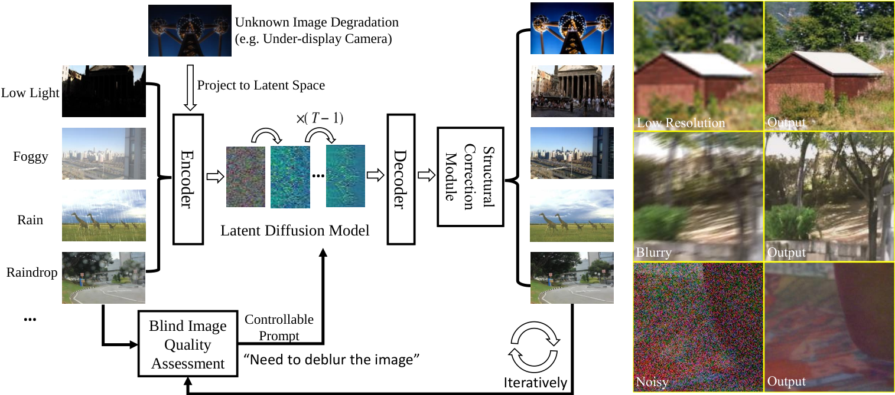

# AutoDIR：Automatic All-in-One Image Restoration with Latent Diffusion

> 论文：Yitong Jiang、Zhaoyang Zhang（共同一作）、Tianfan Xue、Jinwei Gu，香港中文大学（CUHK），ECCV 2024。
>
> 原文：arXiv:2310.10123，HTML 全文 https://arxiv.org/html/2310.10123v2 ｜ 代码 https://github.com/jiangyitong/AutoDIR ｜ 项目页 https://jiangyitong.github.io/AutoDIR_webpage/
>
> 一句话定位：**第一篇用"文本到图像潜在扩散模型"做统一（all-in-one）图像恢复、并用 VLM 自动检测退化类型的工作。**

## 1. 一句话理解

AutoDIR 不做"单任务模型 ×N"，而是搭一条自动流水线：先用微调过的 CLIP 当"盲图像质量评估器"（BIQA）自动判断图片的主导退化并生成一句文本嵌入，再用这句文本当作条件去驱动 Stable Diffusion 做图像精修（AIR），最后用一个轻量结构校正模块（SCM）把扩散生成中扭曲掉的人脸、文字等细节"拉回"原图结构。对多退化图片，它把这条流水线迭代跑几轮：每轮先修掉当前最严重的退化，再把结果重新送回去检测下一个。

## 2. 写作思路

作者的叙事主线是"现实图有未知/多重退化 → 单任务模型和图到图模型都覆盖不了 → 借用文本到图像扩散的语义编辑能力 + VLM 的感知能力 → 但扩散会破坏结构 → 加一个校正模块兜底"：

1. 单任务模型只在各自任务内表现好，遇到真实图（同时有模糊、低光、噪声等）就失效。
2. 把多个单任务模型拼起来，需要用户自己识别退化、手动挑模型，不现实。
3. 已有的统一恢复方法分两类：基于生成先验（GAN/扩散）的需要显式退化函数，端到端判别式（AirNet 等）只能覆盖固定的少数任务、且缺乏"幻觉"缺失细节的能力。
4. 于是作者把"文本到图像扩散 + VLM"这两个在语义编辑上已经成熟的能力，迁移到"图像质量任务"上，用一个模型覆盖 7 种恢复任务。
5. 但扩散生成在纹理上不稳定，所以再加 SCM 校正结构。

这篇论文最值得记住的，不是某个单点技巧，而是**它把"图像恢复"重新表述成"文本条件引导的图像编辑"**，从而让自然语言 prompt 成为统一 7 个任务的开关。

## 3. 背景与经典组件

### 3.1 统一图像恢复的两条老路

- **生成先验路线（GAN/扩散先验）**：如 DDRM、DDNM、GDP 等，把预训练生成模型当先验，在反向过程中用退化算子约束。问题是它们往往需要**显式已知的退化函数**（线性算子），对复杂退化（运动模糊等）难以泛化。
- **端到端判别式路线**：AirNet、TransWeather、IDR 等，用退化分类器/特征引导恢复网络。问题一是**只能统一固定、有限的退化类型**，二是**没有生成能力**，补不出缺失的纹理。

AutoDIR 的 BIQA 也是"退化分类器"，但它把分类结果翻译成**自然语言文本嵌入**去驱动扩散模型，所以同时拿到了"退化感知"和"生成式补细节"两个能力。

### 3.2 CLIP 与文本到图像扩散

- **CLIP**：图文对齐的双塔模型，图像编码器 `E_I`、文本编码器 `E_T`。AutoDIR 只微调 `E_I`，冻结 `E_T`。
- **Latent Diffusion Model（LDM / Stable Diffusion）**：在 VAE 的潜空间里做 DDPM 前向/反向，UNet 骨干带交叉注意力，可被文本条件 `y` 驱动。AutoDIR 用它当"编辑器"。

## 4. 结构图精读



### 4.1 三条主线（Fig. 1 左侧）

```
低质量输入 I
  └─① BIQA：检测主导退化 → 生成文本嵌入 e_auto
        └─② AIR：以 e_auto 为条件的潜扩散编辑 → 中间结果 I_sd
              └─③ SCM：用原图 I 校正 I_sd 的结构 → 最终结果 I_res
```

三个模块串成一条"感知 → 编辑 → 校正"的链；对多退化图，把 `I_res` 重新丢回 ①，迭代检测下一个主导退化。

### 4.2 BIQA 内部（Fig. 2）

```
图像 I ──E_I(微调)──► 图像嵌入
                        │  余弦相似度
文本 prompt 集 T ──E_T(冻结)──► K 个文本嵌入
                        │  softmax
                        ▼
                e_auto = Σ p̂(c_i|I) · E_T(T_i)
```

prompt 模板为 `"A photo needs {c_i} artifact reduction."`，其中 `c_i ∈ {noise, blur, low-light, haze, rain, raindrop, ...}` 是预定义的 K 种退化。`e_auto` 是"按置信度加权的文本嵌入"，而非硬分类的 one-hot，因此信息更平滑，也能直接进扩散模型。

## 5. 模块一：BIQA —— 把 CLIP 微调成盲图像质量评估器

### 5.1 从余弦相似度到文本嵌入

给定图像嵌入 `E_I(I) ∈ R^d` 和 K 条 prompt 嵌入 `E_T(T) ∈ R^{K×d}`，先算余弦相似度：

```text
logit(c_i | I) = E_I(I) · E_T(T_i) / (‖E_I(I)‖₂ ‖E_T(T_i)‖₂)      (1)
```

再 softmax 得到退化置信度，并按置信度加权求和得到输出文本嵌入：

```text
p̂(c_i | I) = exp(logit(c_i|I)) / Σ_{j=1..K} exp(logit(c_j|I))     (2)
e_auto     = Σ_{i=1..K} p̂(c_i|I) · E_T(T_i)                       (3)
```

训练时冻结 `E_T`，只微调 `E_I`，用 fidelity loss（Bhattacharyya 系数形式，即 1 减去"预测分布与 one-hot 真值分布的 √ 内积"）：

```text
L_FID = 1 − Σ_i √( p(c_i|I) · p̂(c_i|I) )                          (4)
```

其中 `p(c_i|I)` 是 one-hot（只对主导退化取 1）。

### 5.2 关键巧思：Semantic-Agnostic 约束

直接微调 CLIP 会有个坑：原始 CLIP 是按**语义**（猫/狗）编码图像的，而不是按**画质**（噪/清晰）。于是微调后的编码器可能还是"看内容"而非"看质量"。

作者加了语义无关约束损失，惩罚"模型在干净 GT 图上仍检测出退化"：

```text
L_SA = Σ_i √( p(c_i|I) · p̂(c_i|I_gt) )                           (5)
L_BIQA = L_FID + L_SA                                              (6)
```

直觉：`p(c_i|I)` 是"退化图 I 的主导退化是 c_i"（监督信号），`p̂(c_i|I_gt)` 是"模型认为干净图 I_gt 里也有 c_i 退化"（要抑制）。这逼着 `E_I` 去学**画质差异**而不是语义差异。Fig. 5 的 t-SNE 直接验证了这点：加了 SA 约束后，退化图嵌入与干净图嵌入能分开，不加则混在一起。

## 6. 模块二：AIR —— 把 Stable Diffusion 变成"恢复编辑器"

### 6.1 双条件注入

AIR 用两个条件：

- **文本条件 `e ∈ {e_auto, e_user}`**：通过 UNet 的交叉注意力注入，负责"告诉模型修哪种退化"（disentangle 任务）。
- **图像条件 `z_I = E_ldm(I)`**：输入图经 LDM 编码器得到的潜表示，与噪声潜 `z_t` **在通道维拼接**后喂进 UNet，负责"告诉模型改哪张图"。

于是去噪器变成：

```text
ε_θ( e, [z_t, z_I], t )
```

训练目标就是标准条件扩散的噪声预测：

```text
L_AIR = E_{E_ldm(x), c_I, e, ε, t} [ ‖ε − ε_θ(e, [z_t, z_I], t)‖₂² ]   (9)
```

反向采样结束后，把编辑后的潜 `ẑ` 过 LDM 解码器得到中间结果 `I_sd = D(ẑ)`。

### 6.2 为什么"文本 prompt"能统一 7 个任务

这是本文的核心机理，Fig. 8 给了直接证据：换不同的 prompt 关键词（"raindrop"/"rain" vs "haze"/"underexposure"），扩散的交叉注意力图会显著变化——相关关键词的注意力聚焦在真实退化区域，无关关键词则分散到整图。也就是说，**文本条件像一把"区域开关"**，引导扩散模型只去改有问题的像素，从而在一个扩散模型里 disentangle 不同恢复任务。

## 7. 模块三：SCM —— 修正扩散的结构失真

### 7.1 残差校正与系数 w

扩散生成强在"补细节"，弱在"保结构"——人脸、文字常被扭曲。SCM 用一条残差把原图结构"加回来"：

```text
I_res = I_sd + w · F( [I_sd, I] )                                  (10)
```

`F` 是轻量结构校正网络，输入是中间结果 `I_sd` 与原始图 `I` 的拼接；`w ∈ [0,1]` 是可调系数：

- **w 大** → 更依赖原图上下文，适合**结构一致性要求高**的任务（如低光增强）。
- **w 小** → 保留更多扩散生成能力，适合**需要幻觉细节**的任务（如超分）。

这一"按任务调 w"的设计，本质是在"生成幻觉"和"结构保真"之间做显式权衡。

### 7.2 训练技巧：用一步估计代替采样

采样 `ẑ` 很慢，所以训练 SCM 时不做完整反向采样，而是用"一步去噪估计" `z̃`（即从噪声潜直接估出的干净潜，公式 11，本质是 DDIM 里的 `x0` 预测）：

```text
z̃ = z_t/√ᾱ − √(1−ᾱ) · ε_θ(e,[z_t,z_I],t) / √ᾱ                       (11)
L_SCM = ‖ I_gt − ( F(D(z̃), I) + D(z̃) ) ‖₂²                        (12)
```

这样 SCM 的训练不需要反复跑扩散采样，成本可控。

## 8. 论文创新点

1. **首次把文本到图像扩散用于统一图像恢复**：把"恢复"重定义成"文本条件编辑"。
2. **BIQA 自动感知 + 文本嵌入引导**：用微调 CLIP 自动检测主导退化，生成 `e_auto` 作为任务开关；同时支持 `e_user` 人工控制。
3. **Semantic-Agnostic 约束**：让 CLIP 编码器从"看语义"转向"看画质"，是全文最精妙的小技巧。
4. **SCM 结构校正**：显式修复扩散生成的纹理失真，并靠系数 w 在保真与生成之间按任务权衡。
5. **迭代处理多退化**：在未见过的 UDC（屏下摄像头）和 EUVP（水下）数据上，展示了"先提亮→再去模糊→再去雾"的多轮退化消除。

## 9. 实验解读（逐表）

作者在 7 个任务上评估，对比 CNN 单任务骨干 NAFNet、生成骨干 Stable Diffusion（两者都用与 AutoDIR 相同的配置微调），以及 3 任务 all-in-one 的 AirNet。

### 9.1 Table 1：五任务 PSNR/SSIM/LPIPS

| 任务 | AutoDIR (PSNR/SSIM/LPIPS) | 对比要点 |
|---|---|---|
| 去噪（SIDD 真实） | 36.91 / 0.919 / 0.145 | 略低于 NAFNet(37.08) 但远高于 SD(32.64) |
| 去噪（合成 σ25） | 30.12 / 0.885 / 0.093 | 略低于 AirNet(30.99)，合成域是扩散幻觉的弱项 |
| 去雨 | 33.05 / 0.954 / 0.036 | 优于 NAFNet(30.46) 与 SD(23.21) |
| 去雾 | 28.14 / 0.962 / 0.021 | 全面领先 |
| 去雨滴 | 29.89 / 0.929 / 0.058 | 全面领先 |
| 低光增强 | 20.81 / 0.883 / 0.141 | 略低于 NAFNet(21.15)，扩散在曝光任务上像素保真吃力 |

### 9.2 Table 2：去模糊与超分（含 MUSIQ / CLIP-IQA 盲指标）

- 去模糊 GoPro 26.86、HIDE 25.26；超分 DIV2K ×4 27.32、×8 23.57。
- **盲感知指标大幅领先**：MUSIQ 在去模糊/×4/×8 上为 53.73 / 52.01 / 48.99，远超 NAFNet（43.28 / 39.01 / 21.31）和 SD——这正是扩散"生成补细节"的强项：像素指标（PSNR/SSIM）未必最好，但**看起来更自然、更像真图**。

### 9.3 Table 3：消融（去雨滴 / 去雾）

| 配置 | 去雨滴 PSNR | 去雾 PSNR |
|---|---|---|
| w/o SCM & BIQA（裸 SD） | 24.84 | 23.49 |
| w/o BIQA | 28.84 | 27.62 |
| w/o SCM | 25.58 | 23.60 |
| **AutoDIR（完整）** | **29.89** | **28.14** |

结论：BIQA 和 SCM 都有用，**BIQA 的贡献更大**（去掉它掉最多），SCM 主要补结构保真。二者互补。

## 10. 可行性分析：t-SNE 与多退化迭代

- **Fig. 4（t-SNE）**：7 种退化的图像嵌入在特征空间里能清晰分开，说明"退化是可判别的"，BIQA 回归可行。
- **Fig. 3 / 多退化迭代**：在未见过的 UDC、EUVP 上，模型先判断"欠曝"→ 提亮 → 再判断"模糊"→ 去模糊 → 再判断"雾"→ 去雾。每次处理后嵌入会"迁移"到下一个退化的簇，说明迭代式"逐个击破"真实发生。
- **Fig. 5**：SA 约束是"退化图 vs 干净图可分离"的关键（见 §5.2）。
- **Fig. 8（交叉注意力）**：文本 prompt 确实在空间上引导模型聚焦退化区域（见 §6.2）。

## 11. 局限与批判性阅读

1. **退化集是封闭的 K 类。** BIQA 只能从预定义的退化类型里选"主导退化"，对完全未见过的失真（如镜头光晕、极端 HDR 裁剪、复合色偏）没有对应 prompt。
2. **"主导退化"假设。** 一次只识别一个 dominant 退化，靠迭代补救，但迭代次数、终止条件、每轮的语义漂移都没有严格保证。
3. **像素指标在部分任务上反而落后。** 合成去噪（30.12 vs AirNet 30.99）、低光（20.81 vs NAFNet 21.15）都略低——扩散幻觉在需要严格像素保真的任务上是双刃剑，这与他们 Multinex 那篇"低光 PSNR 才是主战场"的取向正好相反。
4. **体量与效率。** 依赖大规模预训练 SD，模型重、采样慢；和 Multinex（44.7K 参数）是光谱两端。论文未重点讨论推理延迟。
5. **SCM 的 w 是手工调的。** 每个任务该用多大的 w 没有自适应机制，本质是"人肉搜索"出的权衡。
6. **"统一" ≠ "最优"。** 7 个任务上它很少拿第一，更多是"一个模型尽量不差"，这是 all-in-one 方法的通病；论文自己也承认合成域会"comparable or slightly lower"。

## 12. 学习问题

- **为什么用软加权文本嵌入 `e_auto` 而不是硬 one-hot？** 软权重保留退化置信度的连续性，信息更平滑，且能直接作为扩散的条件向量；硬分类会把"轻度低光 + 轻度噪声"这种模糊情况粗暴归为单一退化。
- **为什么 SA 约束能起作用？** 它把"检测退化"和"抑制在干净图上误报"绑定，逼编码器输出对**画质**敏感、对**语义**不敏感的表征。
- **为什么扩散在盲指标（MUSIQ/CLIP-IQA）上强、像素指标上弱？** 扩散善于生成符合自然图像先验的纹理（人看着真），但生成内容未必逐像素对齐 GT。
- **为什么 w 在低光任务调大、超分任务调小？** 低光增强主要改亮度、结构必须原样保留；超分需要"造出"高频细节，过强的原图约束会抑制生成能力。

## 13. 按全文顺序通读

**摘要与引言**：目标是解决"真实场景多未知退化"。核心观点是恢复任务共享共同算子（提 SNR、补细节、调对比度），因此可学一个统一模型；并借生成模型补细节的能力 + VLM 的感知能力，做成"自动检测 + 自动恢复"。

**相关工作**：统一恢复分两类（生成先验 vs 端到端判别式），各自有"需显式退化函数"或"任务覆盖窄、无生成力"的短板；文本到图像编辑（InstructPix2Pix、Imagic、Prompt-to-Prompt）在语义编辑上很强，但没被用到图像质量任务。AutoDIR 的落点正是"补这个空"。

**Methodology**：BIQA（检测→文本嵌入）→ AIR（文本+图像双条件扩散）→ SCM（残差结构校正），三段式，公式 1–12 全部对应。

**Experiments**：先做可行性分析（t-SNE、迭代多退化、交叉注意力），再上 7 任务的定量对比与消融。

**Discussion**：定位为"复杂真实场景自动恢复的首个综合框架"，展望局部增强与多任务视频恢复。

## 14. 数学建模逐步解释

### 14.1 把"退化检测"写成分类 + 加权嵌入

BIQA 不做普通分类（输出类别标签），而是输出**类别概率加权后的文本嵌入**（公式 1–3）。这一步很关键：普通分类标签无法直接驱动扩散，而 `e_auto` 是活在 CLIP 文本空间里的向量，正好能被 UNet 的交叉注意力消费。

### 14.2 把"恢复"写成条件去噪

标准 LDM 去噪目标是 `‖ε − ε_θ(z_t, t, y)‖²`（公式 7–8）。AutoDIR 把文本条件 `y` 换成 `e`，并把图像条件 `z_I` 拼进输入通道（公式 9）。所以它没有发明新扩散，只是**把条件"接线"改成（文本提示 + 输入图潜表示）**，这也是它能快速复用 SD 权重的原因。

### 14.3 把"结构保真"写成残差项

SCM 的 `I_res = I_sd + w·F([I_sd, I])`（公式 10）是标准的残差学习：`I_sd` 提供生成式增强，`F([I_sd, I])` 提供结构修正增量，`w` 控制二者比重。训练 SCM 时用一步估计 `z̃`（公式 11）代替完整采样（公式 12），是效率上的务实妥协。

## 15. 全文结论、局限与阅读判断

AutoDIR 的完整贡献链可以压缩成一条线：

```text
退化的低质图 I
  → CLIP-BIQA 检测主导退化，生成文本嵌入 e_auto（含 SA 约束）
  → 文本 e_auto + 潜空间 z_I 双条件驱动 Stable Diffusion（AIR）
  → 中间结果 I_sd 与原图 I 一起进 SCM 做残差结构校正
  → 若仍有多退化，把 I_res 迭代送回 BIQA
```

把它放进你的笔记体系里看，位置很清晰：

- **对比 GPP-LLIE**：GPP 用 VLM 生成"感知先验图"注入一个单任务扩散低光网络；AutoDIR 用 CLIP 当**退化分类器 + prompt 生成器**，驱动一个覆盖 7 任务的扩散编辑器。VLM 的"用法"不同：前者是空间先验注入，后者是文本条件引导。
- **对比 4KAgent / HybridAgent**：那些是"感知—规划—工具—反馈"的智能体范式；AutoDIR 是**固定三段流水线 + 自动退化感知**，没有 LLM 规划器，但共享"先感知再恢复"的核心思想，可视为"不带规划的轻量 agent 化恢复"。
- **对比 DATPRL-IR**：两者都是 all-in-one，但 DATPRL 用**可学习 prompt pool**做任务提示，AutoDIR 用**自然语言文本嵌入**做任务提示——一个"学出来的提示"，一个"说出来的提示"。
- **对比 Multinex**：光谱两端。Multinex 是 44.7K 参数的极致轻量残差增强；AutoDIR 靠大预训练 SD 的生成幻觉，在盲感知指标上更有优势，但像素保真和效率都不占优。

**阅读这篇论文最该带走的设计原则**：当任务变得"多而未知"，与其堆多个模型或手工选模型，不如让一个 VLM 负责"感知退化"、一个文本到图像扩散负责"执行恢复"，再用一个轻量残差模块负责"修正生成副作用"。感知、生成、校正三者解耦，是 AutoDIR 真正的架构价值。
